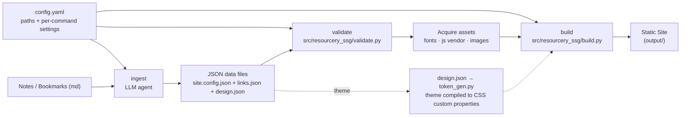
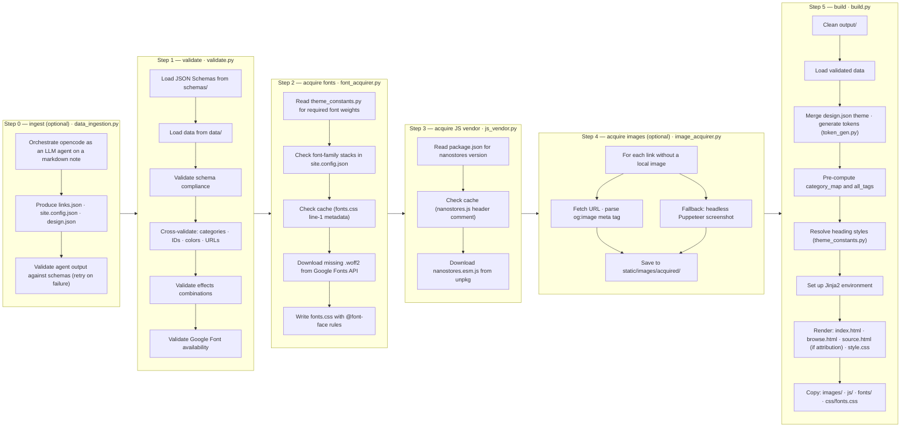
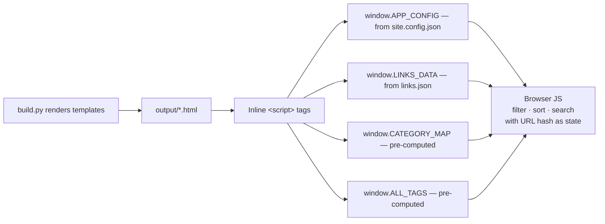
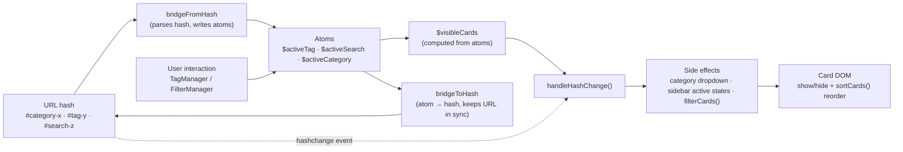

# Contributing to Resourcery.ssg

## File Structure

### File / Folder Roles

| Path | Type | Role |
|------|------|------|
| `src/resourcery_ssg/__init__.py` | Python init | Package marker for the `resourcery_ssg` namespace. Contains module docstring only. |
| `src/resourcery_ssg/site.py` | Python script | Unified `site` CLI coordinator. Reads `config.yaml` once, applies CLI overrides, and dispatches to subcommands: `build`, `validate`, `acquire-fonts`, `acquire-js`, `acquire-images`, `ingest`, `all`. |
| `src/resourcery_ssg/config.py` | Python script | Config loading/merging. Implements the priority chain CLI overrides > environment / `.env` > user config > committed `config.yaml`, with `${VAR}` interpolation. |
| `src/resourcery_ssg/config.yaml` | Config | Committed default configuration. `vars:` section defines paths (data, templates, static, output, schemas, fonts, images); per-command sections hold settings for build, validate, acquire-*, and ingest. |
| `src/resourcery_ssg/build.py` | Python script | Main rendering entry point. Loads validated data, merges `design.json` theme, generates CSS design tokens, renders Jinja2 templates into static HTML/CSS, copies static assets, pre-computes category maps and tag lists from JSON data. |
| `src/resourcery_ssg/validate.py` | Python script | Data integrity gate. Validates JSON data against JSON Schema (draft-07), cross-validates categories/tags/IDs, checks hex colors, URLs, font availability, and effect compatibility. |
| `src/resourcery_ssg/font_acquirer.py` | Python script | Build-time Google Font downloader. Fetches `.woff2` files from Google Fonts API, caches locally, generates `fonts.css` with embedded `@font-face` rules. Zero CDN dependency at runtime. |
| `src/resourcery_ssg/image_acquirer.py` | Python script | Link image downloader. Extracts images from link URLs via `og:image` meta tags or headless Puppeteer screenshots. |
| `src/resourcery_ssg/js_vendor.py` | Python script | Build-time Nanostores JS acquirer. Downloads `nanostores.esm.js` from unpkg, prepends a header comment, caches to `static/js/vendor/`. |
| `src/resourcery_ssg/theme_constants.py` | Python script | Single source of truth for heading style configuration (weight, letter-spacing, required font weights). Imported by `build.py` and `font_acquirer.py`. |
| `src/resourcery_ssg/token_gen.py` | Python script | Pure, deterministic functions that compile the `design.json` theme into a flat dict of CSS custom properties (color conversion, dark-token derivation, spacing/radius/elevation/motion scaling). Used by `build.py` at render time. |
| `src/resourcery_ssg/data_ingestion.py` | Python script | Agentic data ingestion CLI. Orchestrates `opencode` as an LLM agent to transform raw markdown notes into `links.json`, `site.config.json`, and `design.json`. Supports multi-step pipelines with per-stage config, retries, and validation of agent output. |
| `schemas/links.schema.json` | JSON Schema | JSON Schema definition for `data/links.json`. Defines required properties, types, and constraints for every link entry. |
| `schemas/site.config.schema.json` | JSON Schema | JSON Schema definition for `data/site.config.json`. Defines site info, navigation (categories, menu links), content sections, and feature flags. |
| `schemas/design.schema.json` | JSON Schema | JSON Schema definition for `data/design.json`. Defines the design token source: colors (incl. dark-mode levers), typography, layout, spacing, radius, elevation, border, motion, and effects presets. |
| `templates/` | Directory | Jinja2 templates that produce the static site output. |
| `templates/base.html` | Jinja2 template | Shell layout. DOCTYPE, `<head>`, theme injection, navigation, footer, modal shell, JS globals from build context. Extended by all page templates. |
| `templates/index.html` | Jinja2 template | Landing page. Renders featured links (shuffled, limited by `featured_count`), hero section. |
| `templates/browse.html` | Jinja2 template | Browse/filter page. Renders all links with `data-*` attributes for client-side filtering, sorting, search. |
| `templates/modal.html` | Jinja2 template | Link detail modal. Populated from `data-*` attributes on card elements at runtime. |
| `templates/source.html` | Jinja2 template | Attribution source page. Rendered only when `build.attribution` is enabled — documents the ingested source note and site prompt that produced the data. |
| `templates/style.css` | Jinja2 template | Themed CSS. Rendered through Jinja2 to inject `--color-*`, `--shadow-*`, `--border-radius`, `--heading-*` CSS custom properties from the merged config (design tokens from `design.json` via `token_gen.py`). |
| `static/` | Directory | Source static assets. Copied verbatim into `output/static/` during build. |
| `static/js/main.js` | JavaScript | ES module bootstrap (~30 lines). Imports all managers from `static/js/modules/`, wires atom ↔ URL hash bridge, initialises managers. |
| `static/js/dom.js` | JavaScript | DOM manifest. Exports a `dom` object with all cached `document.getElementById()` references used across modules. |
| `static/js/modules/` | Directory | ES modules: `state.js` (Nanostores atoms), `tag-manager.js`, `modal-manager.js`, `theme-manager.js`, `sidebar-manager.js`, `card-manager.js`, `entry-animator.js`, `filter-manager.js`, `filter-cards.js`, `sort-cards.js`, `slugify.js`, `handle-hash-change.js`. |
| `static/js/vendor/` | Directory | Vendored third-party JS (gitignored). Currently contains `nanostores.js` acquired at build time. |
| `package.json` | Config | Declares the Nanostores npm dependency version (used at build time only — no Node.js runtime needed) and the Vitest/jsdom dev toolchain with test scripts (`test`, `test:unit`, `test:integration`). |
| `package-lock.json` | Lock file | npm lock file for the dev-only test toolchain. Commit to ensure reproducible test installs. |
| `vitest.config.js` | Config | Vitest configuration: jsdom environment, shared setup/helpers, alias of the build-time `vendor/nanostores.js` import to the real npm package, and the unit/integration project split. |
| `tests/` | Directory | Python test suite (pytest). Unit tests for every `src/resourcery_ssg` module plus integration tests. Markers: `unit`, `integration`, `network` (skipped by default), `e2e` (skipped by default — requires an LLM model). |
| `tests/js/` | Directory | JavaScript test suite (Vitest + jsdom). Unit tests per module in `tests/js/unit/` and integration tests (hash routing, filter, modal, sidebar, sort, dark mode, entry animation, deep linking) in `tests/js/integration/`. |
| `static/images/acquired/` | Directory | Downloaded link images (from `image_acquirer.py`). |
| `output/` | Directory | Build output (gitignored). Complete static site ready for any HTTP server. |
| `schemas/` | Directory | JSON Schema files. Used for validation and as LLM prompt guidance during data creation. |
| `pyproject.toml` | Config | Poetry project configuration. Requires Python `^3.10`. Defines dependencies (production + dev), scripts (`build`, `validate`, `acquire-images`, `acquire-fonts`, `acquire-js`, `ingest`, `site`), and tool configs (pytest with testpaths/markers, Black). |
| `poetry.lock` | Lock file | Poetry dependency lock. Commit to ensure reproducible builds. |

---

## Version Control

### Branch Strategy

- `main` is the single long-lived branch.
- Work is committed directly to `main`. No feature branches or PR workflow is currently established.
- To add feature branch workflow, create branches off `main` named `feat/<short-description>` or `fix/<short-description>`.

### Commit Style

Conventional commit prefixes are used, with an optional scope in parentheses when the change targets one subsystem:

| Prefix | When to use |
|--------|-------------|
| `feat:` | A new feature or capability |
| `fix:` | A bug fix |
| `refactor:` | Code restructuring without behavior change |
| `test:` | Test suite additions or changes |
| `docs:` | Documentation or non-functional changes |
| `chore:` | Maintenance (dependencies, tooling, gitignore) |

Scopes seen in history: `js`, `ui`, `build`, `state`, `site`, `validate`, `schema`, `package`, `ingest`, `theme`, `static`, `design`, `config`.

Commit messages should be descriptive but concise (one line). Example:

```
feat(build): add optional attribution footer and source pages
```

### What Is Tracked / Ignored

**Tracked:** Python source, Jinja2 templates, JSON schemas, config files (`pyproject.toml`, `poetry.lock`, `package.json`, `package-lock.json`, `vitest.config.js`, `src/resourcery_ssg/config.yaml`), test suites (`tests/`, `tests/js/`), documentation, specs and roadmaps.

**Not tracked** (in `.gitignore`): `data/` (input data), `output/` (build artifacts), `*.sh` files, images, font binaries, vendored JS (`static/js/vendor/`), IDE config (`.vscode/`, `.kilo/`).

---

## Architecture

### Overview

Resourcery.ssg is a **static site generator (SSG)** with zero runtime dependencies. All processing happens at build time, producing a directory of plain HTML/CSS/JS that works with any HTTP server.



### Design Principles

1. **Zero runtime dependencies.** No CDN, no API calls, no JavaScript frameworks. Everything is downloaded or rendered at build time.
2. **Separation of concerns.** Each Python module is a standalone entry point with a single responsibility: validation, build, font acquisition, image acquisition, ingestion, token generation. `site.py` is a thin coordinator that dispatches to them, never a place for new logic.
3. **Config-driven paths.** Every path and per-command setting lives in `config.yaml`, resolved through the priority chain CLI overrides > environment / `.env` > user config > committed config. Modules never hardcode paths.
4. **Data-on-DOM pattern.** All link metadata is embedded in `data-*` attributes on card elements. The modal reads from these attributes — no template re-rendering needed.
5. **Build-time pre-computation.** `category_map` and `all_tags` are computed once during build and serialized into `window` globals. The browser never parses full data for these lookups.
6. **URL hash routing.** All filter/sort/tag/search state is encoded in the URL fragment. Enables bookmarkable links and browser back/forward.
7. **CSS Variables for theming.** Entire visual identity is controlled by CSS custom properties injected at build time. The design source of truth is `design.json`, compiled to tokens by `token_gen.py` (including dark-mode token derivation).
8. **Progressive enhancement.** Filters have native `<select>` fallbacks. JS failure degrades gracefully.
9. **LLM-friendly design.** JSON Schema `description` fields are written to guide LLMs in generating appropriate data. The ingestion tool turns raw notes into validated data via an agent loop.

### Python Modules

Each Python module is a standalone CLI with a `main()` function and `if __name__ == '__main__'` guard. They share no state — data flows through JSON files on disk and Python data structures passed to Jinja2. They also accept their paths as arguments, so the `site` coordinator (`site.py`) can resolve paths from `config.yaml` (via `config.py`) and forward CLI overrides to the right module.

```python
# Standard pattern:
def main():
    ...

if __name__ == '__main__':
    main()
```

The module's own CLI is the fallback for ad-hoc use (`poetry run build`, `poetry run ingest`, ...); the `site` CLI (`poetry run site build`, `poetry run site all`, ...) is the recommended entry point for full runs.

### Frontend

The frontend uses a **modular ESM architecture** backed by [Nanostores](https://github.com/nanostores/nanostores) atoms for observable state. The `static/js/modules/` directory contains 12 ES modules imported by the slim `static/js/main.js` bootstrap.

| Module | Responsibility |
|--------|---------------|
| `state.js` | Nanostores atoms (`$activeTag`, `$activeSearch`, `$activeCategory`, `$animatedIds`), computed `$visibleCards`, URL-hash bridge (`bridgeFromHash`, `bridgeToHash`). |
| `tag-manager.js` | Search suggestions, active tag/search state, filter header display. |
| `modal-manager.js` | Open/close link detail modals with keyboard/overlay support. |
| `theme-manager.js` | Dark/light mode toggle with `localStorage` persistence. |
| `sidebar-manager.js` | Collapsible category accordion, mobile overlay. |
| `card-manager.js` | Click/keyboard handlers on link cards and tag badges. |
| `filter-manager.js` | Custom dropdown for category/sort with full ARIA. |
| `entry-animator.js` | Scroll-triggered card entry animation with `IntersectionObserver`. |
| `filter-cards.js` | Applies `$visibleCards` to the DOM (show/hide, re-animate). |
| `sort-cards.js` | Reorders card elements by date or title. |
| `slugify.js` | Pure slugify helpers. Slugifies tag labels for URL-hash compatibility (diacritics folding, non-ASCII letters preserved, hash decoding for search matching). |
| `handle-hash-change.js` | Bridges URL hash changes to atoms and DOM side-effects. |

The `dom.js` manifest caches all `document.getElementById()` lookups. The URL `hashchange` event is the single source of truth for cross-module state coordination; atoms provide reactive observability within modules.

### JSON Data Shape

**`data/site.config.json`:** site-level configuration validated against `schemas/site.config.schema.json`.
```json
{
  "site_info": { "name", "url", "description", "logo", "favicon" },
  "navigation": {
    "categories": [{ "id", "label", "icon", "children" }],
    "menu_links": [{ "label", "url" }]
  },
  "content": { "landing", "header", "footer", "errors", "placeholders" },
  "features": { "search", "dark_mode" }
}
```

**`data/design.json`:** design token source validated against `schemas/design.schema.json`. Compiled to CSS custom properties at build time.
```json
{
  "theme": {
    "colors": { "primary", "secondary", "background", "surface", "text", "text_muted", "accent", "error", "success", "levers", "dark" },
    "typography": { "font_family", "heading_font", "font_size_base", "type_scale_ratio", "body_line_height", "heading_line_height", "measure", "heading_weight", "heading_letter_spacing" },
    "layout": { "sidebar_width", "max_width" },
    "spacing": { "space_base", "space_ratio" },
    "radius": { "radius_base", "radius_card", "radius_button", "radius_pill" },
    "elevation": { "shadow_strength", "shadow_softness" },
    "border": { "border_width", "border_style", "border_color" },
    "motion": { "transition_duration", "transition_easing" },
    "effects": { "card_style", "hover_effect", "heading_style", "entry_animation" }
  }
}
```

**`data/links.json`:** Array of objects validated against `schemas/links.schema.json`. Required: `id`, `title`, `summary`, `url`, `category`, `tags`. Optional: `description`, `image`, `created_at`, `updated_at`, `featured`, `status`, `pricing`, `language`.

---

## Docstring Style

### Python

- **Module-level docstring:** Triple-quoted string at top of file describing the module's purpose.
- **Class docstring:** Triple-quoted string describing class responsibility.
- **Function docstring:** All functions use the following strict format.
- **Inline comments:** Used sparingly for non-obvious logic.

```python
def my_function(param: str) -> bool:
    """Short description of what the function does.

    param: description of the parameter.

    Returns: description of the return value.

    ExceptionName1: condition that triggers the error. (omitted if none)
    ExceptionName2: condition that triggers the error. (omitted if none)

    Side-effects: description of side-effects. (omitted if none)
    """
```

Rules:
- `param:` — one line per parameter, repeating the parameter name verbatim.
- `Returns:` — always included; use `None` for void functions.
- `ExceptionName:` — omitted entirely if the function raises no documented exceptions.
- `Side-effects:` — omitted entirely if none.
- Blank lines between sections are required.

Class and module-level docstrings follow the same structure at their respective scope.

```python
"""
Module docstring: short description of the module's purpose.

Side-effects: any notable module-level side-effects on import. (omitted if none)
"""
```

### JavaScript

- **File header:** Block comment `/* ... */` describing the module.
- **Section dividers:** `// ==================== SECTION NAME ====================`
- **Inline notes:** Line comments `//` for bugfix markers, removed code annotations.
- **No JSDoc types.** Functions are not formally documented beyond naming.

### CSS (Jinja2 template)

- **Section dividers:** `/* ============ SECTION ============ */`
- **Override notes:** `/* image-overlay: no overrides needed — base styles handle it */`

### JSON Schema

- **`description` fields** serve dual purpose: human documentation and LLM prompt guidance. Write them as complete sentences describing valid values and their meaning.

---

## Data Flow

### Build Pipeline (sequential)

Paths and settings for every step come from `config.yaml` (with CLI/env overrides). The `site` CLI (`poetry run site all`) runs the whole pipeline below in order; each step can also be invoked individually (`poetry run site <step>` or the module's own script).



### Data to Browser



### Client-Side State Flow



**Key point:** The DOM is the data layer. Card elements carry all their metadata as `data-*` attributes. Filtering is done by toggling `display: none` — no virtual DOM, no re-rendering. Nanostores atoms provide reactive, observable state with built-in equality checks to prevent update loops.

---

## Notes

- **`src/resourcery_ssg/theme_constants.py` is a shared dependency** between `src/resourcery_ssg/build.py` and `src/resourcery_ssg/font_acquirer.py`. Both import it. If you change heading styles, update the constant, not each file.
- **`tojson` filter** is used in Jinja2 for safe Python→JavaScript serialization (`{{ config \| tojson }}`). Never use `json.dumps()` manually for template injection.
- **Font cache invalidation** is done by comparing the first line of `static/css/fonts.css` (a `/* {"font_name": {...}} */` JSON comment) against requested fonts. If any font is missing or has different weights, only the needed fonts are re-downloaded.
- **Effects presets** in `design.json` (`card_style`, `hover_effect`, `heading_style`, `entry_animation`, etc.) are documented in `schemas/design.schema.json` with valid values. Adding a new effect value requires updating the schema, the token generation logic, and the CSS template.
- **Config priority chain** is CLI overrides > environment / `.env` > user config > committed `config.yaml` (see `src/resourcery_ssg/config.py`). When adding a new setting, give it a default in `config.yaml` and a `COMMAND_FLAGS`/`ARG_TO_CONFIG_KEY` entry in `site.py` if it should be overridable via CLI.
- **Shell scripts (`.sh`)** are gitignored. They are local development conveniences, not part of the build system.
- **`specs/` and `roadmaps/` contain the project's planning documents.** Specs are grouped by type (`feats/`, `refactors/`, `tests/`, `docs/`) and state their status in frontmatter. `plans/` is gitignored workspace scratch.
- **`AGENTS.md`** holds AI-agent instructions (this file) and points to `AGENTS.local.md` for machine-local overrides.
- **Two test suites exist.** Python: `poetry run pytest` (unit + integration; `network` and `e2e` markers are skipped by default — run them explicitly with `-m`). JavaScript: `npm test` (Vitest + jsdom; `npm run test:unit` / `npm run test:integration` for the split). Both suites must pass before committing.
- **`data/CV/`** is an alternative dataset (French-language CV resources) with its own `site.config.json`. The build script does not reference it — it's kept for reference.

---

## Todo

### Short-term

- [ ] Add CI configuration (GitHub Actions or similar) to run pytest + Vitest on push
- [ ] Add a lint step (`black --check`) to the build pipeline
- [ ] Document the `data/CV/` alternative dataset or remove it from the repo
- [ ] Add coverage reporting for both test suites (pytest-cov, `vitest --coverage`)
- [ ] Make the Python test suite self-contained: `tests/conftest.py` reads fixtures from `data/testdata/`, which is gitignored — a fresh clone cannot run `pytest` (vendor fixtures under `tests/fixtures/` or un-ignore them)
- [ ] Unify Python docstring style: `config.py` uses Google-style `Args:` blocks while the project convention (see `specs/docs/docstring.md`) is the `param:` format
- [ ] Standardize type hints across remaining Python modules

### Long-term

- [ ] Consider extracting category/tag/effect validation into a dedicated validation module instead of inline functions in `validate.py`
- [ ] Add JSDoc type annotations (`// @ts-check`) to frontend modules (deferred from the modular ESM refactor)
- [ ] Add end-to-end tests that build the full site from a fixture and verify output HTML structure
- [ ] Evaluate CSS minification as a build step (e.g., `cssnano` via Python subprocess)
- [ ] Add HTML validation (`nu-html-checker` or similar) to the build pipeline
- [ ] Consider a headless CMS or YAML frontmatter approach for link authoring
- [ ] Evaluate incremental builds (skip re-rendering if data hasn't changed)
- [ ] Add RSS/Atom feed generation from links data
- [ ] Add sitemap.xml generation for SEO
- [ ] Consider moving from Poetry to pip/uv for simpler dependency management
- [ ] Add support for multiple theme variants from a single config
