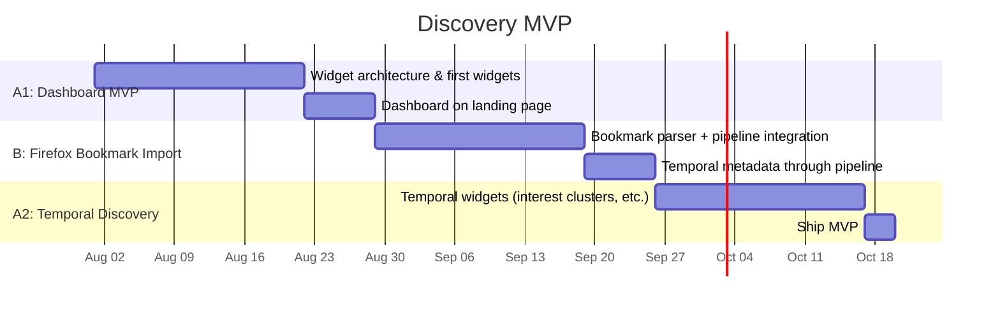

# Roadmap: Discovery MVP

## Long-term ambition

Deliver on the central promise of Resourcery: *"Bookmark what interests you and
forget about it. Rediscover it later."* This roadmap sequences the minimal set
of capabilities needed to prove that promise works — from the first discovery
dashboard to bookmark import to temporal-interest widgets.

See [VISION.md](../VISION.md) for the full vision.

## Assumptions & constraints

- **Team size:** solo developer
- **Hard deadline:** none, but momentum matters — each phase should be
  shippable in 2-4 weeks
- **Scope boundary:** no dynamic backend, no real-time sync, no accounts
- **Output format:** static HTML/CSS/JS only (client-heavy stays core)
- **Bookmark format v1:** Firefox bookmarks export only (JSON format).
  Chrome/bookmark.html support deferred.

## Selected scenario

The sequence is **A1 → B → A2**:

1. **A1 — Dashboard MVP (static).** Build the widget architecture and 1-2
   discovery widgets using *existing* pipeline data (categories, tags,
   featured links). This establishes the UI pattern and proves "rediscovery"
   works even without temporal data.
2. **B — Firefox bookmark import.** Add a Firefox bookmarks JSON parser to
   the pipeline's input stage. Temporal metadata (date_added, last_visited,
   visit_count) flows through the full 7-step pipeline and lands in the
   output data.
3. **A2 — Temporal widgets.** With temporal data now available in the output,
   add 1-2 widgets that visualise interest shifts, forgotten clusters, or
   visit-frequency patterns.

This order was chosen because:
- Phase A1 delivers visible value fast and validates the dashboard concept
- Phase B is pure backend plumbing — doing it second means the plumbing has
  a clear consumer (the temporal widgets in A2)
- Phase A2 completes the promise: temporal discovery is the differentiator

## Milestones

| Milestone | Phase | Deliverables |
|-----------|-------|--------------|
| Dashboard MVP | A1 | Widget architecture decision. 1-2 static widgets (e.g., tag cloud, random pick). Widgets integrated into landing page. |
| Bookmark import | B | Firefox JSON parser module. Pipeline step 1 extended to handle bookmark format. Temporal fields preserved through all steps. |
| Temporal discovery | A2 | 1-2 widgets using date/visit/frequency data. Dashboard now shows interest evolution. |
| MVP ship | — | Everything above, tested, documented. A single command from bookmark export → live discovery site. |

## Decision points

1. **End of Phase A1** — Review widget architecture. Is it extensible enough
   for Phase A2? If not, refactor before Phase B.
2. **End of Phase B** — Verify temporal data integrity. Are date fields
   surviving the pipeline? Is the output data model correct?
3. **Mid-Phase A2** — Validate that temporal widgets actually reveal something
   interesting. If the data is too sparse, consider enriching with LLM-derived
   temporal signals (e.g., estimated reading time, topic emergence dates).

## Related specs

- [Bookmark Import](../specs/feats/bookmark_import.md) — Phase B spec stub
- `specs/feats/discovery_widgets.md` — Phase A1 (not yet created)
- `specs/feats/temporal_widgets.md` — Phase A2 (not yet created)
