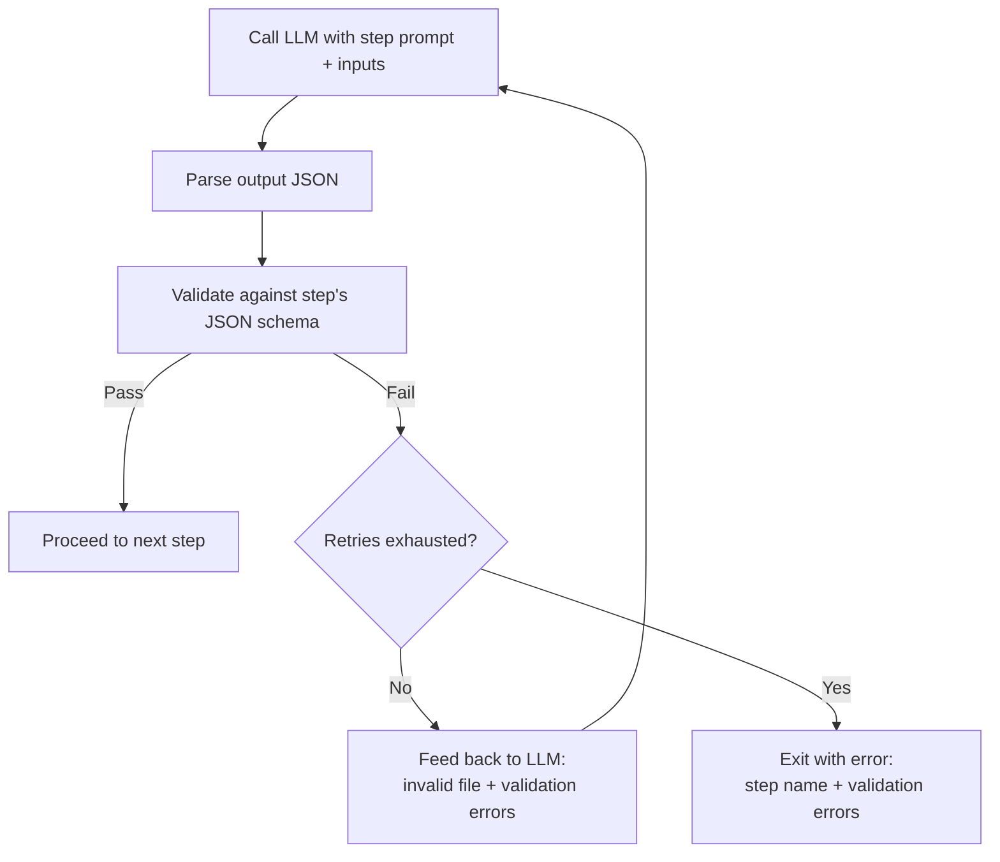

# Multi-step data ingestion with retry logic

## Introduction

The existing `data_ingestion.py` (specified in [`specs/feats/data_ingestion.md`](data_ingestion.md)) makes a single opencode call to generate all three JSON files (`site.config.json`, `links.json`, `design.json`) at once, with all three schemas inlined into one monolithic prompt. Smaller or weaker models struggle with this one-shot approach — they produce missing fields, hallucinated values, and validation failures.

This spec extends data ingestion to support a **multi-step pipeline** that:

1. **Breaks the LLM call into 3 sequential steps**, each focused on one output file with only its own schema inlined (reducing cognitive load per call).
2. **Adds retry logic** — when schema validation fails, the validation error is fed back to the LLM for correction.
3. **Adds cross-validation** at the end of the pipeline to ensure inter-file consistency.
4. **Adds per-step prompt files** under `prompts/` so each step's instruction is focused and maintainable.

The existing single-shot mode remains unchanged for backwards compatibility.

## Current state

The existing `data_ingestion.py` (as implemented by the [`data_ingestion.md`](data_ingestion.md) spec):

- Reads a raw markdown note, a site prompt, schemas, and a single monolithic prompt (`prompts/data-ingestion.md`).
- Composes a single instruction with all three schemas (`site.config.schema.json`, `links.schema.json`, `design.schema.json`) inlined.
- Makes one opencode call.
- Expects all three JSON files to be generated simultaneously in one agent session.
- Has **no validation loop** — the agent is trusted to produce correct output. The script only checks that the output files exist, not that they conform to their schemas.
- Has a single prompt file at `prompts/data-ingestion.md`.
- Has no integration with the project's config system (`config.yaml`, environment variables, `.env` files) — unlike every other CLI tool in the project (`build.py`, `validate.py`, `font_acquirer.py`, `image_acquirer.py`), all its settings must be passed as CLI flags, even project-level settings like the schemas directory or model name that rarely change.

The core limitation: this single-shot approach is fragile with smaller models (e.g., GPT-4o-mini, some local models). The combined schema can exceed the model's effective context reasoning window, leading to structural errors that are never caught or corrected.

## Target state

### 3-step pipeline

The ingestion is broken into **3 sequential steps**, each making its own opencode call:

---

#### Step 1: Generate `site.config.json`

| Property | Value |
|----------|-------|
| **Inputs** | Note content, site prompt, `site.config.schema.json` |
| **Prompt** | `prompts/ingest-site-config.md` |
| **Output** | `site.config.json` |
| **Content scope** | Site identity, taxonomy/categories, navigation, content copy, features |
| **Key behaviour** | The LLM must define the category hierarchy and content copy based on the note's content and the site's purpose |

The LLM receives only the `site.config.schema.json` schema (not the other two). It defines the category taxonomy from scratch — these categories are the source of truth for Step 2.

---

#### Step 2: Generate `links.json`

| Property | Value |
|----------|-------|
| **Inputs** | Note content, site prompt, `links.schema.json`, **plus `site.config.json` from Step 1** |
| **Prompt** | `prompts/ingest-links.md` |
| **Output** | `links.json` |
| **Content scope** | Links with metadata, assigned to categories from Step 1 |
| **Key behaviour** | The LLM must use the categories defined in Step 1; every `link.category` must exist in `site.config.navigation.categories` |

The LLM receives `site.config.json` (just generated) as context, so it knows which categories are available. Every category assigned to a link must match one of the categories defined in Step 1.

---

#### Step 3: Generate `design.json`

| Property | Value |
|----------|-------|
| **Inputs** | Note content, site prompt, `design.schema.json` |
| **Prompt** | `prompts/ingest-design.md` |
| **Output** | `design.json` |
| **Content scope** | Visual theme, colors, typography, layout, effects |
| **Key behaviour** | Independent of the other two files — purely visual design decisions based on content tone |

The LLM receives only the `design.schema.json` schema. No dependency on Steps 1 or 2.

---

### Retry logic

Each step has an independent retry loop with the following flow:

**Retry protocol:**
1. Make the opencode call for the step.
2. Validate the output against its JSON schema using the existing `DataValidator`.
3. If validation passes → proceed to next step.
4. If validation fails → feed back to the LLM:
   - The previously generated (invalid) file content.
   - The validation error message(s) — which fields are missing, which violate patterns, which types are wrong, etc.
   - Ask the LLM to fix the specific errors in a corrected version.
5. Repeat up to `--max-retries` times (default: 3).
6. If all retries are exhausted → stop with a clear error showing which step failed, the validation errors, and the last (invalid) output.

**Important:** Each retry is a fresh opencode call — there is no multi-turn conversation state. The retry prompt includes both the previous output and the validation error as context. This keeps the implementation simple and avoids accumulating conversation history.

---

### Cross-validation

After all 3 steps succeed individually, run **cross-validation** across all output files:

| Check | Description |
|-------|-------------|
| **Category consistency** | Every `link.category` must exist in `site.config.navigation.categories` (at any nesting level) |
| **Tag consistency** | All `link.tags` should be consistent in format (all strings, no duplicates within a link) |
| **ID format** | All IDs across files match `^[a-z0-9-]+$` |
| **Color format** | All color values across files match `^#[0-9a-fA-F]{6}$` |
| **Existing checks** | The same checks `DataValidator.cross_validate()` already performs (maintained in the validator, not duplicated here) |

If cross-validation fails, the script exits with an error listing all violations found.

---

### Per-step prompt files

Create three new prompt files under `prompts/`:

| File | Purpose |
|------|---------|
| `prompts/ingest-site-config.md` | Instruction for generating `site.config.json`. Focused on site identity, taxonomy, navigation, content copy. Includes only `site.config.schema.json`. |
| `prompts/ingest-links.md` | Instruction for generating `links.json`. Focused on link extraction, metadata enrichment, category assignment. Includes `links.schema.json` plus references `site.config.json` for categories. |
| `prompts/ingest-design.md` | Instruction for generating `design.json`. Focused on visual theme, colors, typography, layout. Includes only `design.schema.json`. |

Each should be a focused version of the current `prompts/data-ingestion.md`, adapted for its specific step. The existing `prompts/data-ingestion.md` is **kept as-is** (not deleted) for reference and for use with single-shot mode.

---

### Config system integration

`data_ingestion.py` is brought into the project's existing config system, matching the pattern used by `build.py`, `validate.py`, and the acquirer scripts. An `ingest` section is added to the committed `config.yaml` with project-level settings: the schemas directory, the prompt file path, the output directory, the model name, whether multi-step mode is enabled, the maximum retry count per step, and the opencode binary path.

The config system's priority chain applies: CLI flags win over environment variables and `.env` files, which win over a user-supplied config file (via `--config`), which wins over the committed `config.yaml`. This means only per-run inputs like `--note` and `--site-prompt` must be passed on every invocation; everything else can be set once in `config.yaml` and overridden only when needed.

A `--config` flag is added to point to an optional user config YAML that layers on top of the committed defaults.

---

### Changes to `data_ingestion.py`

The existing `data_ingestion.py` CLI is **extended** (not replaced):

**New flags:**

| Flag | Type | Default | Description |
|------|------|---------|-------------|
| `--multi-step` | flag | from config | Enable the 3-step pipeline instead of single-shot mode |
| `--max-retries` | int | from config | Maximum retries per step (only meaningful with `--multi-step`) |
| `--config` | path | none | Path to a user config YAML layered on top of committed defaults |

**Changes to existing flags:**

Most flags that were previously required become optional, with defaults drawn from the config system. Only `--note` and `--site-prompt` remain required — they are per-run inputs that cannot have sensible project-level defaults. The `--schemas`, `--prompt`, `--model`, `--output`, and `--opencode-path` flags now fall back to their counterparts in the `ingest` section of `config.yaml` when omitted.

**Behaviour when `--multi-step` is used:**
- Steps run sequentially (Step 1 → Step 2 → Step 3).
- Intermediate files are written to a temporary workspace.
- Schema validation runs after each step (using `DataValidator`).
- Retry on validation failure (up to `--max-retries` attempts per step).
- Cross-validation runs after all 3 steps complete successfully.
- If any step exhausts its retries, the script exits with code 1 and a clear error message describing:
  - Which step failed.
  - The validation errors.
  - The last invalid output (file path).
- If cross-validation fails, the script exits with code 1 listing all violations.

**Behaviour without `--multi-step` (default):**
- Unchanged — single-shot mode, no validation loop, no cross-validation.
- Fully backwards compatible.

---

### Changes to test

The existing E2E test at `tests/test_data_ingestion.py` is extended to also exercise the multi-step path:

- Either a new test function or a parameterized version of the existing test.
- Uses the same fixtures (notes, site prompts, schemas).
- Passes the `--multi-step` flag.
- Validates the same acceptance criteria as the single-shot test (files exist, validate against schemas).
- Should also test the retry path (ideally by injecting a schema-violating output and verifying the retry is triggered).

---

### Acceptance criteria

1. `python data_ingestion.py --multi-step --note ... --site-prompt ... --schemas ... --model gpt-4o` produces valid output files (`site.config.json`, `links.json`, `design.json`).
2. Each step only receives its relevant schema (not all three) — verified by inspecting the opencode instruction.
3. On validation failure, the model is retried with the validation error context (observable in logs or by tracing).
4. After `--max-retries` failures, the script exits with code 1 and a clear error message.
5. Cross-validation catches mismatched categories between files (e.g., a `link.category` that does not exist in `site.config.navigation.categories`).
6. The E2E test passes with the `--multi-step` flag.
7. The existing single-shot behaviour is unchanged (backwards compatible) — all existing tests still pass without `--multi-step`.

## Decisions

1. **Retries are stateless** — each retry is a fresh opencode call with previous output + error as context, not a multi-turn conversation. This keeps the implementation simpler and avoids potential issues with growing conversation history.
2. **Cross-validation after all steps** — not interleaved. Each step validates its own output individually; cross-validation is deferred until all three files exist.
3. **`--max-retries` defaults to 3** — provides enough attempts for most transient failures without excessive cost.
4. **Existing single-shot mode is the default** — changing the default would break existing scripts and workflows. The multi-step mode is opt-in.
5. **Per-step prompt files are new files** — they don't replace `prompts/data-ingestion.md`. The original prompt remains as the single-shot artifact.
6. **Intermediate files** from multi-step mode are written to a temp workspace and cleaned up on success (unless `--debug` is passed), mirroring the existing behaviour.
7. **Config integration follows the existing pattern** — an `ingest` section in `config.yaml`, loaded via `load_resourcery_config()`, with the same priority chain (CLI > env > user config > committed config) used by every other tool in the project. `data_ingestion.py` was the only tool missing this integration.

## Open questions

1. Should each step's prompt also include the output from the *previous* successful steps (beyond what is strictly necessary for input)? For example, should Step 2's prompt include the site prompt and note again, or just `site.config.json`?
   - **Tentative answer:** Yes — each step's prompt should include the original note and site prompt as context, plus the step-specific schema and (for Step 2) the previous step's output. This ensures each step has full context.
2. Should retry prompts include the **raw model output** or a **parsed/pretty-printed version** of the invalid file?
   - **Tentative answer:** Pretty-printed JSON — easier for the model to reason about.
3. Should retry prompts include the **exact schema** again, or just the validation errors?
   - **Tentative answer:** Include both — the schema (concise) and the validation errors (specific). This gives the model the original contract plus the concrete failures.
4. Should the existing `DataValidator` be extended to expose retry-friendly error messages, or are its current messages sufficient?
   - **Tentative answer:** Current messages from `jsonschema` should be sufficient. Revisit if models struggle to act on them.
5. Should the max-retries count apply **per step** or **globally** across all three steps?
   - **Tentative answer:** Per step. A step that fails 3 times is a fundamental problem with that step's prompt or inputs — it should not consume retries from other steps.

## Related specs

### Extends
- [specs/feats/data_ingestion.md](data_ingestion.md) — this spec adds multi-step mode, retry logic, cross-validation, and per-step prompts to the ingestion pipeline built by that spec.

### Enables
- Easier path to local/small model support — by reducing the per-call complexity, smaller models can produce valid output step by step.
- Agentic error recovery — the retry mechanism proves the concept of "LLM validates and corrects its own output", which could be extended to other parts of the system.

### See also
- `prompts/data-ingestion.md` — the original monolithic prompt, kept for single-shot mode.
- `prompts/ingest-site-config.md`, `prompts/ingest-links.md`, `prompts/ingest-design.md` — the new per-step prompt files (created by this spec).

## Technical details

- The per-step prompt files should each in-line only their relevant schema (not all three). For Step 2, the prompt should also reference the `site.config.json` from Step 1 and instruct the LLM to read it for valid categories.
- The retry loop should log warnings on each retry (e.g., `WARNING  Step 1 (site.config.json) failed validation — retry 1/3`).
- The final error message on retry exhaustion should include the full validation error output, so users can diagnose whether the issue is with the prompt, the schema, or the model.
- Cross-validation should reuse `DataValidator.cross_validate()` — do not duplicate validation logic.
- The `--multi-step` flag should raise an error if combined with `--prompt` (since multi-step uses per-step prompts, not the monolithic one). Alternatively, `--prompt` is simply ignored in multi-step mode and each step reads its own prompt file. **Tentative decision:** ignore `--prompt` in multi-step mode (backwards compatible, no error).
- The step prompts should live under `prompts/` alongside `data-ingestion.md` for discoverability.
- `OPENCODE_DISABLE_PROJECT_CONFIG=1` applies to each step's opencode call, just as in single-shot mode.
- The config system's `_NON_PATH_KEYS` set in `config.py` must include `model`, `opencode_bin`, and any other ingest settings whose string values are not filesystem paths, to prevent `load_resourcery_config()` from resolving them into `Path` objects.
- If `data_ingestion.py` gains enough internal logic, the step orchestration (sequential execution, retry loop, cross-validation) should be factored into a separate function (e.g., `run_multi_step_ingestion(...)`) that the test can call directly.

---

> **Note on file paths:** This spec references `data_ingestion.py` for the existing
> code. As of spec [`refactors/src_layout_package.md`](../refactors/src_layout_package.md),
> the source code now lives under `src/resourcery_ssg/data_ingestion.py`. All
> references to `data_ingestion.py` in this spec should be interpreted as
> `src/resourcery_ssg/data_ingestion.py`.