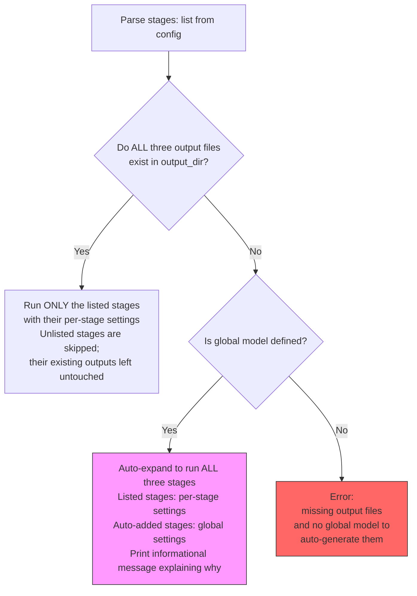

# Per-stage configuration with cascading defaults and selective execution

## Introduction

The current multi-step pipeline (`data_ingestion.py`, specified in [`multi_step_ingestion.md`](multi_step_ingestion.md)) uses a single `--model` and `--max-retries` globally across all 3 steps (site.config → links → design). There is no way to:

- Use a cheap, fast model for the relatively mechanical link-extraction step while reserving a more expensive, design-capable model for the visual design step.
- Set different retry counts per stage (e.g., retry design more aggressively since visual output is subjective).
- Run only a subset of stages — for example, re-running just `design` to iterate on visuals without re-running links extraction and incurring unnecessary LLM cost.

This spec introduces **per-stage configuration with cascading defaults** and **selective stage execution** to the `ingest:` section of `config.yaml`, giving users fine-grained control over model selection, retry behaviour, and which pipeline stages execute.

## Current state

In the `run_multi_step_ingestion()` function (implemented per [`multi_step_ingestion.md`](multi_step_ingestion.md) at `git tag specs/feats/multi_step_ingestion.md/implemented`):

- A single `model` parameter flows into every step's opencode call — all three steps use the same model.
- A single `max_retries` parameter applies uniformly to every step's retry loop.
- The `STEPS` list runs unconditionally: all three steps execute in a fixed order every time.
- The `config.yaml` `ingest:` section has flat global keys (`model`, `max_retries`, `multi_step`, etc.) with no per-stage substructure.

## Target state

### Config format

The `ingest:` section of `config.yaml` gains an optional `stages:` subsection. Two modes of operation:

**Mode A — No `stages:` key (backwards compatible):**
The existing behaviour is fully preserved. All three steps run with the global `model` and `max_retries`.

```yaml
ingest:
  model: gpt-4o-mini           # global default
  multi_step: true
  max_retries: 3               # global default
  schemas_dir: ${SCHEMAS_DIR}
  prompt: ./prompts/data-ingestion.md
  output_dir: ${OUTPUT_DIR}
  opencode_bin: opencode
  # stages: absent → run all 3 steps with globals (current behaviour)
```

**Mode B — `stages:` key present (selective execution + per-stage overrides):**
Only the explicitly listed stages execute. Each stage entry is a dict that can optionally override `model` and/or `max_retries`. Missing overrides fall back to the global values.

```yaml
ingest:
  model: gpt-4o-mini           # global default
  multi_step: true
  max_retries: 3               # global default
  schemas_dir: ${SCHEMAS_DIR}
  prompt: ./prompts/data-ingestion.md
  output_dir: ${OUTPUT_DIR}
  opencode_bin: opencode

  stages:
    site.config:                # uses globals for model and max_retries (no override)
    design:                     # only this stage has overrides
      model: claude-sonnet-4
      max_retries: 5
```

In this example, only `site.config` and `design` run — `links` is skipped because it is not listed. The `site.config` stage uses the global `model` (`gpt-4o-mini`) and `max_retries` (`3`). The `design` stage uses its own `model` (`claude-sonnet-4`) and `max_retries` (`5`).

**Stage keys** are the logical stage names (without `.json` extension):

| Stage key | Output file | Depends on |
|-----------|-------------|------------|
| `site.config` | `site.config.json` | *(none)* |
| `links` | `links.json` | `site.config.json` |
| `design` | `design.json` | *(none)* |

**Stage entry schema:**

| Field | Type | Default | Description |
|-------|------|---------|-------------|
| `model` | string | global `model` | LLM model identifier for this stage's opencode call |
| `max_retries` | int | global `max_retries` | Maximum retry attempts on validation failure for this stage |

Both fields are optional. Omitting a field means "use the global default." Omitting a stage entry entirely (i.e., not listing it under `stages:`) means "do not run this stage."

### Cascading defaults

The resolution order for any per-stage setting is:

```
per-stage override > global ingest setting
```

Specifically:

| Global key | Falls back to | When per-stage override is missing |
|------------|---------------|------------------------------------|
| `ingest.model` | *(required)* | `stages.<name>.model` → `ingest.model` |
| `ingest.max_retries` | `3` | `stages.<name>.max_retries` → `ingest.max_retries` |

If `stages:` is present but `ingest.model` is not set, and a listed stage does not provide its own `model`, the system errors out with a clear message identifying which stage is missing a model and that no global default exists.

### Selective stage execution

When `stages:` is present:
- **Only the listed stages execute**, in their natural pipeline order (site.config → links → design). For example, if `stages:` lists `{links, design}`, `site.config` is skipped and execution begins at `links`.
- Stages not listed are skipped — their output files are **not** generated or overwritten. If output files from a previous run exist on disk, they are left untouched.

When `stages:` is absent:
- All three stages execute in order (backwards compatible).

### Output completeness check

All three output files (`site.config.json`, `links.json`, `design.json`) are required to build the website. Before running a selective set of stages, the system checks whether the full output set already exists on disk. This is not about intra-pipeline dependencies between stages — it is about the build-time requirement that all three JSON files be present and consistent.

When `stages:` is specified, the system performs a completeness check:



**Completeness check:**
Before running, the system checks whether **all three** output files — `site.config.json`, `links.json`, and `design.json` — exist in the output directory. The check is all-or-nothing: if any one file is missing, the output set is considered incomplete.

**Scenario 1 — All three output files exist:**
User specifies `stages: { design: { model: X } }` and `site.config.json`, `links.json`, and `design.json` all exist in the output directory (from a previous full run). The system runs only `design` with model X. `site.config` and `links` are skipped — their existing output files are left untouched. No auto-expansion.

**Scenario 2 — Output set incomplete, globals defined:**
User specifies `stages: { design: { model: X } }` but `links.json` is missing from the output directory (even though `design` has no intra-pipeline dependency on `links`). The system **auto-expands** to run all three stages:
- `site.config` → uses global `model` and `max_retries`
- `links` → uses global `model` and `max_retries`
- `design` → uses per-stage `model: X` (and global `max_retries` if not overridden)

The system prints an informational message to stderr explaining the auto-expansion:

```
ℹ️  Output set incomplete — links.json not found in output directory. Automatically
    running full pipeline to generate all required output files. Stages listed in
    config use their per-stage settings; auto-added stages use global defaults.
```

**Scenario 3 — Output set incomplete, no globals:**
User specifies `stages: { design: { model: X, max_retries: 2 } }` but `site.config.json` is missing, and the global `ingest.model` is not set. The system errors out:

```
Error: Output set incomplete — site.config.json not found in output directory
and no global 'model' is defined to auto-generate it. All three output files
(site.config.json, links.json, design.json) are required to build the website.
Either:
  1. Set 'ingest.model' in config.yaml as a global default, or
  2. Run the full pipeline first to generate all output files, or
  3. Provide per-stage 'model' for all missing stages in the stages: section.
```

**Rationale:** The build step (`build.py`) requires all three files to exist. A selective run that produces only a subset would leave the output directory in an unusable state. The completeness check ensures that either the output set is already complete (so selective execution is safe) or the full pipeline runs (to guarantee a complete set). This is a stronger check than a dependency-graph approach, which would incorrectly allow running `design` alone in an empty output directory — producing only `design.json` and leaving the site unbuildable.

### Changes to `run_multi_step_ingestion()`

The function signature changes to accept per-stage configuration:

| Current parameter | Change |
|-------------------|--------|
| `model: str` | Replaced by `global_model: str` |
| `max_retries: int = 3` | Replaced by `global_max_retries: int = 3` |
| *(none)* | New: `stage_config: Optional[dict]` — a mapping of stage key → `{"model": ..., "max_retries": ...}` |
| *(none)* | New: `requested_stages: Optional[list]` — the ordered list of stage keys to execute (derived from `stages:` config keys) |

The function must:
1. **Resolve per-stage settings** — for each stage, determine the effective `model` and `max_retries` by preferring per-stage overrides, falling back to globals.
2. **Check output completeness** before executing — if `requested_stages` is present (non-None), examine the output directory for **all three** output files. If any are missing, either auto-expand to the full pipeline (when global model is defined) or error out.
3. **Execute only the resolved stages** — skip stages not in the resolved set. If auto-expansion occurred, this is the full set; otherwise, it is the requested subset.
4. **Cross-validation** — still runs at the end, using whatever output files exist. If a stage was skipped and its output file from a previous run is present, it participates in cross-validation. If a skipped stage's output file is absent, cross-validation should warn but not fail (since the user intentionally omitted it).

### Config system changes

**`config.yaml`:**
The `ingest:` section gains an optional `stages:` subsection.

**`config.py`:**
- `_NON_PATH_KEYS` already handles `model` at every nesting level (since `_resolve_paths` checks the key name regardless of depth). No changes needed for `model`. The `max_retries` values are integers and are unaffected by path resolution.
- No new CLI flags are introduced at this time — the spec is config-only.

### Backwards compatibility

| Scenario | Behaviour |
|----------|-----------|
| `stages:` key absent | All three stages run with global settings — identical to current behaviour |
| `stages:` present, lists all three stages with no overrides | Same as absent — all run with globals |
| Global `model` absent, but each listed stage specifies its own `model` | Valid — each stage uses its own model |
| `stages:` present, `multi_step: false` | `stages:` is ignored; single-shot mode is used. A warning is printed if both are set. |

## Decisions

1. **Stage keys are `site.config`, `links`, `design`** — logical names without the `.json` extension. These are the identifiers users think about; the mapping to output filenames is an implementation detail.

2. **`stages:` presence controls both what runs AND per-stage overrides** — a single dict serves dual purpose. This keeps the config surface minimal: listing a stage means "run it," and optionally providing fields means "with these overrides."

3. **No `skip: true` flag** — the absence of a stage from the `stages:` dict is the mechanism for skipping. An explicit `skip: true` would be redundant and could introduce contradictions (what does `skip: true` with overrides mean?). If users later express a need for documenting intentional skips in config, a `# intentionally skipped` YAML comment serves the same purpose.

4. **Selective execution requires all three output files to already exist** — the gate for selective execution is an output completeness check, not a per-stage dependency graph. All three files (`site.config.json`, `links.json`, `design.json`) are required to build the website, so the system refuses to run a subset unless the full set is already on disk. If any file is missing and global model is defined, the full pipeline auto-expands.

5. **No CLI flags for per-stage settings** — for now, per-stage configuration is config-only. It is a project-level concern (which model fits which stage best) and doesn't change on a per-run basis. CLI flags may be added later if a use case emerges.

6. **Auto-expansion message is informational (stderr), not a warning and not blocking** — the behaviour is intentional and expected. Users should see why it happened but don't need to confirm.

7. **Cross-validation still runs after selective execution** — it validates whatever output files exist. If a stage was skipped and its file is absent from a prior full run, cross-validation prints a warning for the missing file rather than failing.

## Open questions

1. **Should the cross-validation step at the end also be configurable** (e.g., skip it when only re-running design)?
   - **Tentative answer:** Not in this spec. Cross-validation is fast (no LLM calls) and serves as a safety net. If users report friction, a `cross_validate: false` flag can be added to the `ingest:` section in a follow-up spec.

2. ~~When auto-expanding, should only the dependency chain run or all three stages?~~
   - **Resolved (see Decisions, item 4):** All three stages always auto-expand — the pipeline must produce a complete output set. This question was superseded by the switch from dependency-graph to output-completeness logic.

3. **What happens if `stages:` lists only `design` and all three files exist on disk, but `site.config.json` and `links.json` are stale** (from an old run with different inputs)?
   - **Tentative answer:** The system cannot detect staleness — file existence is treated as "output set complete." If users want fresh outputs, they should either delete the old files or list all stages explicitly. A future spec could add file-timestamp comparison or a `--force` flag.

4. **Should per-stage model settings be exposed as environment variables** (e.g., `INGEST_STAGES_LINKS_MODEL=...`)?
   - **Tentative answer:** Not in this initial spec. Config-only is sufficient. Environment variable support follows naturally from the config system's `${VAR}` resolution — users can use `${MY_MODEL}` in their per-stage `model` values for dynamic substitution.

5. **What is the behaviour when `stages:` lists a stage that doesn't exist** (e.g., a typo like `desing`)?
   - **Tentative answer:** Error out immediately with a clear message listing the valid stage keys. This catches typos early rather than silently skipping a desired stage.

## Related specs

### Extends
- [specs/feats/multi_step_ingestion.md](multi_step_ingestion.md) — this spec adds per-stage configuration and selective execution on top of the 3-step pipeline defined there.

### See also
- [specs/feats/data_ingestion.md](data_ingestion.md) — the original single-shot ingestion spec that the multi-step pipeline extends.
- [specs/refactors/data_design_split.md](../refactors/data_design_split.md) — the original 7-step pipeline design (different architecture; context for why split-stage pipelines are valuable).

## Technical details

- The `STEPS` list in `run_multi_step_ingestion()` already defines the three output filenames. The completeness check uses these filenames (hardcoded as `REQUIRED_OUTPUTS` at module level) to determine which files to look for in the output directory. The `depends_on` field on each step remains relevant only for feeding context from earlier steps during execution — it is not consulted for the pre-execution completeness gate.
- The per-stage `model` values must be added to `_NON_PATH_KEYS` in `config.py` if they are not already handled. Currently `_NON_PATH_KEYS = frozenset({"model", "opencode_bin", "agent"})` — the `_resolve_paths` function checks keys at every nesting level, so `model` under `stages.design.model` is already excluded from path resolution. No config.py changes are required.
- The `main()` function in `data_ingestion.py` reads the `ingest:` config dict and passes values to `run_multi_step_ingestion()`. It must be extended to also read the `stages:` subsection (if present) and pass it as the new `stage_config` and `requested_stages` parameters.
- The `output_dir` is already resolved to a `Path` by the config system. The completeness check should look for all three output files (`site.config.json`, `links.json`, `design.json`) in `output_dir` before executing.
- No new CLI flags means the existing `argparse` setup is unchanged. The `--config` flag already allows layering a user config on top of the committed `config.yaml`, which is the intended way to customize per-stage settings for a specific project or run.
- The cross-validation step at the end of `run_multi_step_ingestion()` currently validates all three files. After selective execution, some files may be absent (intentionally skipped with no prior output). The cross-validation should gracefully handle missing files — warn for absent files rather than failing, since their absence is intentional.
