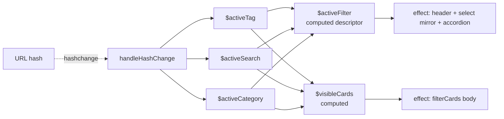

# Refactor: Reactive Effects Layer for the Browse Page

## Introduction

The implemented refactor
[`specs/refactors/js_state_model.md`](js_state_model.md) made filter
*state* reactive: the three filter reactive variables `$activeTag`,
`$activeSearch`, `$activeCategory` (Nanostores calls these "atoms";
throughout this spec "reactive variable" is used — code identifiers
containing "atom", such as `batchAtomWrites`, are exempt and stay as-is)
plus the computed `$visibleCards` and the URL-hash bridge. But it left
**all DOM side-effects imperative at call sites**: every manager that
mutates state also manually triggers the consequences (`filterCards()`,
dropdown/select sync, sidebar active states, filter header).

The result is a scattered wiring layer that has drifted:

- `filterCards()` is called manually at **8 production call sites**
  after every state change, instead of being a reaction to state.
- The sidebar accordion state machine is split across two files, with a
  latent bug: clicking the already-active category trigger collapses the
  whole accordion and never re-expands it.
- `tag-manager.js` reaches into `filter-manager`'s native `<select>` and
  reads its `.value` as *state* (the select has no change listener; it is
  a pure mirror of parsed state).
- Page detection (`window.location.pathname.includes('browse.html')`) is
  duplicated at 7 sites, plus 6 hand-built `browse.html#...` href strings
  in 4 modules.

This spec adds the missing **reactive effects layer**: the DOM side-effects
become subscriptions over the reactive state, registered once at boot; all
manual call sites are deleted. It is behaviour-preserving except for the
documented accordion bug fix.

## Current state

### Verified smells (all confirmed in the current source)

**1. `filterCards()` is called manually at 8 production call sites.**

| Call site | Trigger |
|-----------|---------|
| `static/js/main.js:49` | Boot, after `handleHashChange()` |
| `static/js/modules/filter-manager.js:41` | `clearFilters` window event |
| `static/js/modules/filter-manager.js:73` | Custom category dropdown option click |
| `static/js/modules/handle-hash-change.js:88` | `hashchange` (inside the batch) |
| `static/js/modules/sidebar-manager.js:96` | Subcategory link click |
| `static/js/modules/modal-manager.js:62` | Modal tag chip click |
| `static/js/modules/card-manager.js:42` | Card tag badge click |
| `static/js/modules/tag-manager.js:395` | Search suggestion `navigateToBrowse` |

Every state transition re-implements "call the renderer" by hand. The
computed `$visibleCards` already exists — nothing consumes it reactively.

**2. Sidebar accordion state machine split across two files.**

- Collapse-all loop: `sidebar-manager.js:49-56` (category-trigger click
  handler).
- Expand-matching logic: `handle-hash-change.js:42-80` (inside the
  `hashchange` handler).
- Subcategory clicks re-implement the select/header/hash/filter wiring
  imperatively: `sidebar-manager.js:79-97`.

**LATENT BUG:** clicking the already-active category trigger runs the
collapse-all loop, then writes `window.location.hash = 'category-<id>'`.
If the category is already active, the hash does not change, no
`hashchange` fires, and nothing re-expands — the whole accordion stays
collapsed until the user clicks a *different* category.

**3. `tag-manager` reaches into `filter-manager`'s select; the select is
read as state.**

- Reads: `tag-manager.js:53, 83` (the null-branches of
  `setActiveTag(null)` / `setActiveSearch(null)` read
  `dom.categoryFilter.value` and re-activate a "restored" category),
  `tag-manager.js:170` (`updateFilterHeader` reads the select for the
  category label).
- Writes: `tag-manager.js:99-104` (`setCategoryDisplay`),
  `filter-manager.js:37-38, 55`, `sidebar-manager.js:80`,
  `handle-hash-change.js:34-38`.
- The native `<select>` has **no change listener** (verified). It is a
  pure mirror of parsed state — a write-only projection, not an input.
  `CONTRIBUTING.md` design principle 8 ("native `<select>` fallbacks")
  concerns *progressive enhancement* (the custom dropdown hides the
  select when JS works); it does not make the select an input.

**4. Page detection duplicated 7×; hash-href strings in 4 modules.**

`window.location.pathname.includes('browse.html')`:
`handle-hash-change.js:16`, `sidebar-manager.js:12`,
`card-manager.js:12`, `modal-manager.js:15`, `tag-manager.js:17`,
`filter-cards.js:15`, `main.js:21`.

Hand-built `browse.html#...` strings: `sidebar-manager.js:42, 75`
(`#category-`), `tag-manager.js:381, 384` (`#tag-`, `#search-`),
`card-manager.js:37` (`#tag-`), `modal-manager.js:58` (`#tag-`).

### Batching today

`batchAtomWrites(fn)` in `state.js` (lines 21-39) suppresses only the
URL-hash bridge's writes while a batch is active (nesting depth counter).
It does **not** defer or deduplicate any other subscriber. Nanostores
listeners fire synchronously on every `.set()`, so a tri-state transition
today can cause multiple intermediate DOM passes *if* the call site also
did DOM work inline inside the batch (only `handle-hash-change` does; its
work is inside the batch, so it runs once per transition today — after
the third `.set()`, since the side-effect code runs after all three sets).

### Test surface

Both suites run under Vitest + jsdom (`npm run test:unit`,
`npm run test:integration`); tests use the `loadFresh` pattern from
`tests/js/helpers/setup.js`. 10 test files reference `filterCards()`
(direct calls or side-effect assertions); 10 test files contain the word
"atom" in prose/describe-blocks.

## Target state

### Vocabulary (mandated, applies to prose only)

Docs, comments, and test describe-blocks use neutral language:
**"reactive variable(s)" / "reactive state"**, optionally with the
parenthetical "(or as Nanostores calls them 'atoms')" on first mention.
**No code identifier changes**: `$activeTag`, `batchAtomWrites`, `atom()`,
`computed()` etc. keep their exact names. This spec, the CONTRIBUTING.md
sweep, JS module docstrings/comments, and test describe-blocks all follow
it. The implemented spec `js_state_model.md` stays as history and is **not
rewritten**.

### New derived state: `$activeFilter`

A new computed over the three filter reactive variables:

| Symbol | Kind | Type | Holds |
|--------|------|------|-------|
| `$activeFilter` | computed | `{ kind: 'tag' \| 'search' \| 'category' \| null, value: string \| null }` | A single descriptor of *which* filter is active. `value` is the tag slug, the raw search term, or the category id respectively. |

Because invariant 1 (at most one of the three filter reactive variables is
non-null) is enforced by every writer, the `kind` is unambiguous; the
computed encodes the tri-state (tag XOR search XOR category XOR none)
structurally. This gives the effects layer exactly one subscription point
that sees the whole picture. `$visibleCards` remains untouched.

### Effects layer (subscribers, registered once at boot)

A new module `static/js/modules/effects.js` exports a single function
`installEffects()` that registers **two subscriptions** using a new
batch-aware wrapper `effect(store, cb)` (see Batching below). `main.js`
calls `installEffects()` exactly once, inside the browse-page branch of
its `DOMContentLoaded` boot — replacing today's manual
`handleHashChange()` + `filterCards()` boot calls. Integration tests call
`installEffects()` directly (the same seam `main.js` uses).

**Subscription 1 — `$visibleCards` → card rendering.** The subscriber's
body is the current `filterCards()` body, verbatim: display toggling,
re-animation via the reflow + `rearmCards` pattern, results count,
no-results state. `filterCards` **stays exported** (its body becomes the
subscriber callback; ~10 test files call it directly or assert it ran as
a side-effect). Nanostores subscriptions fire immediately with the current
value, so registering this subscription replaces `main.js:49`'s initial
`filterCards()` call.

**Subscription 2 — `$activeFilter` → header / dropdown / accordion.**
On any change of the descriptor, the subscriber runs, in this order:

1. **Native select mirror + custom dropdown sync** (category kind only).
   For `kind === 'category'`, write `dom.categoryFilter.value = value` and
   call `FilterManager.syncSelection('category', value)`. For every other
   kind (`tag`, `search`, `null`) clear both (`categoryFilter.value = ''`
   and `syncSelection('category', '')`), matching today's
   `handle-hash-change.js:34-38` behaviour (back to a bare URL must not
   leave a stale category anywhere).
2. **Filter header** — the current `TagManager.updateFilterHeader()`
   body, refactored to read `$activeFilter.get()` instead of the three
   reactive variables and the select. All kinds: `tag` → "Showing #tag";
   `search` → "Searching…"; `category`/`null` → "Showing <label>" where
   `<label>` is looked up in the mirrored select's options (the option
   list is static build-time data, not state) — so the select mirror in
   step 1 must run first.
3. **Sidebar accordion sync** — a single new exported function in
   `sidebar-manager.js`, `syncAccordion(descriptor)` (see below). Category
   kind: expand the matching trigger or subcategory, collapse all others,
   set `.active` classes and `aria-expanded`. Every other kind: clear all
   `.active` classes and collapse every list.

Registration order in `installEffects()`: `$activeFilter` first, then
`$visibleCards` — preserving today's header-before-cards sequence.

**Constraint: subscribers are DOM-only.** Effects must never write to
reactive state (no feedback loops); they read final values and touch the
DOM.

### Batching extension

`batchAtomWrites` is extended in `state.js` so that while a batch is
active, effect dispatches are **queued and deduplicated per store**, then
drained **exactly once, synchronously, at the outermost batch exit**,
each effect reading the *final* value of its store at drain time. A new
exported wrapper `effect(store, cb)` (in `state.js`, next to
`batchAtomWrites` and the existing `batchDepth` counter) is the
registration API the effects layer uses; it behaves like Nanostores'
`subscribe` (immediate first fire) but honours batching.

Contract:

- Outside any batch: a `.set()` fires effects synchronously, exactly as
  Nanostores does today — timing unchanged.
- Inside a batch: intermediate `.set()`s do not dispatch anything; the
  single drain at outermost exit runs each effect once, in registration
  order, with final values. This prevents the 3-DOM-passes-per-transition
  problem (the computed `$visibleCards` recomputes per `.set()` inside a
  batch; without the queue, its subscribers would run per `.set()`).
- Nested batches (e.g. a manager call that itself calls a batching
  helper) drain only at the outermost exit.
- The existing URL-hash-bridge suppression behaviour of
  `batchAtomWrites` is unchanged.
- **Timing guarantee:** the drain happens before `batchAtomWrites`
  returns, so "side effects have happened by the time the manager call
  returns" — the assumption existing tests rely on — still holds.

### `handleHashChange` becomes thin

`handle-hash-change.js`'s `handleHashChange()` is reduced to: parse the
hash (via `bridgeFromHash`), then inside one `batchAtomWrites` set the
three reactive variables. Its ~50 lines of manual DOM sync (dropdown,
select, sidebar active states, header, `filterCards`) are **deleted** —
the subscribers do all of it, once, at the batch drain. The browse-page
early-return guard and `installHashChangeListener()` stay.

### Single accordion sync function + bug fix

`sidebar-manager.js` exports `syncAccordion(descriptor)` — one function
implementing "expand matching trigger/subcategory, collapse others, set
active classes" for the category kind and "clear everything" otherwise. It
is the only accordion state machine: driven by the `$activeFilter` effect,
and called **directly by the sidebar click handlers for same-value
clicks**.

Category-trigger click handler becomes:

- If the clicked category is the *already-active* one: write nothing,
  call `syncAccordion({ kind: 'category', value: categoryId })` directly
  (and re-push nothing). **This fixes the latent bug** — the accordion
  stays expanded.
- Otherwise: write `window.location.hash = 'category-<id>'` and let the
  hash → reactive state → effects path do everything (the manual
  collapse-all loop is deleted; the effect collapses others).
- Landing page branch: navigate via the shared URL builder (below).

Subcategory click handler becomes: hash write (or direct
`syncAccordion` for the same-value click) + the mobile auto-close (stays
imperative). Its re-implementation of select/header/hash/filter wiring
(`sidebar-manager.js:79-97`) is **deleted** — the effects do it.

### Page detection and URL building consolidation

A new tiny module `static/js/modules/browse-utils.js` exports:

- **`isBrowsePage()`** — the single page-detection helper, used by all 7
  current sites (`main.js`, `handle-hash-change.js`, `sidebar-manager.js`,
  `card-manager.js`, `modal-manager.js`, `tag-manager.js`,
  `filter-cards.js`) and by future consumers.
- **`browseUrl(kind, value)`** — builds the `browse.html#...` strings
  for the 6 existing href sites (`sidebar-manager.js:42, 75`,
  `tag-manager.js:381, 384`, `card-manager.js:37`, `modal-manager.js:58`).
  It **reuses the canonical hash serialisation**: `state.js` additionally
  exports its existing internal `serialiseHash`, and
  `browseUrl(kind, value)` returns `'browse.html' + serialiseHash(...)`
  with the value placed in the position of its kind. This guarantees the
  links and the bridge can never drift apart (round-trip idempotence is
  preserved). `parseHash` stays internal.

**Decision (recorded):** both helpers live in the new `browse-utils.js`
module rather than in an existing one — no existing module owns both
concerns, and `slugify.js`/`logger.js` establish the "small utility
module" precedent. `state.js` remains the owner of hash serialisation
logic; `browse-utils.js` only re-exposes it in URL form.

### What stays imperative (do NOT reactive-ify)

- `sortCards()` — sort state is not in the reactive model; it stays a
  direct call from the sort dropdown and boot.
- Modal open/close (`modal-manager.js`).
- Theme toggle (`theme-manager.js`).
- Mobile sidebar overlay (open/close class toggling in
  `sidebar-manager.js`).
- Entry animator (`entry-animator.js` owns `$animatedIds`; the IO and
  `rearmCards` stay as-is).
- URL-hash bridge (`bridgeToHash` / `bridgeFromHash`) — untouched.
- Search suggestion rendering, slugify, logger.

### Behaviour contract

Behaviour-preserving **except** the accordion bug fix and the reset
button styling fix. The user-visible surfaces from `js_state_model.md`'s
contract table (filter system, search, tags, card grid, modal, theme,
sidebar, entry animation, hash routing) must all continue to work
unchanged. The specific deltas:

| Change | Behaviour |
|--------|-----------|
| **Bug fix (the only intended behaviour change)** | Clicking the already-active category trigger in the sidebar keeps the accordion expanded instead of collapsing it. |
| **Latent-behaviour elimination** | The null-branches of `setActiveTag(null)` / `setActiveSearch(null)` no longer re-read `dom.categoryFilter.value` and "restore" a category. Today the only caller (`filter-manager.js:38-39`, the `clearFilters` event) clears the select *before* calling them, so this branch is unreachable in practice; deleting it makes the state transition purely reactive-variable-driven and removes the only state-read-through-the-DOM left. |
| **Styling fix (visual only)** | The no-results "Clear filters" button renders larger than the text above it and uses the theme's action color on both themes (was ≈13px black ButtonText in light and dark). |

## Design decisions

1. **One effects module (`effects.js`) installed once by `main.js`.**
   The pitch requires subscriptions registered once at boot; an exported
   `installEffects()` gives integration tests the same seam without
   importing `main.js` (which runs every manager init).
2. **Batch-aware `effect(store, cb)` in `state.js`, not a re-export of
   Nanostores' subscribe.** The batching queue must live next to
   `batchDepth`; exporting the wrapper keeps the effects layer free of
   batching internals.
3. **`$activeFilter` as a computed descriptor, not three subscriptions.**
   One subscription point for "what is active", encoding the at-most-one
   invariant structurally; effects that need only one kind (e.g. the
   accordion, category-only) still get a stable uniform descriptor.
4. **`serialiseHash` exported from `state.js`.** `browseUrl` must produce
   byte-identical segments to the bridge or round-trip idempotence
   drifts. This supersedes the `testing-js.md` constraint that
   `serialiseHash` "stays internal" (see Related specs); `parseHash`
   remains internal.
5. **`filterCards` stays an exported, directly callable function** whose
   body is the `$visibleCards` subscriber callback — the ~10 test files
   that call it directly keep working without change.
6. **Effect registration order fixed** (`$activeFilter` before
   `$visibleCards`) to preserve today's header-before-cards ordering.
7. **Do not reactive-ify sort/modal/theme/overlay/animator** — they have
   no state in the reactive model; moving them would expand the diff
   without consolidating anything.

## Open questions / risks

1. **Test-update scope.** 10 test files reference `filterCards()`; the
   ones that assert "`filterCards` ran as a side-effect of manager X"
   will fail once the manager no longer calls it. Mechanical fix:
   register `installEffects()` in the test's setup (recommended for
   integration tests) or call `filterCards()` explicitly after the
   manager call (unit tests). The `handle-hash-change.test.js` assertions
   on select/header/sidebar side-effects move to effects-driven tests.
   The spec's ACs require both suites green; the exact per-file edits are
   the planner's call. Estimated: 10-12 test files touched, all
   mechanical.
2. **`serialiseHash` export vs. `testing-js.md`.** The implemented
   testing-js.md spec says `parseHash`/`serialiseHash` are "not exported
   and stay internal". This spec lifts that for `serialiseHash` only;
   `testing-js.md`'s Constraints section needs a one-line consistency
   amendment (permitted for implemented specs when keeping documents
   consistent), and `state.test.js` should gain a direct
   `serialiseHash` round-trip test to replace the purely-indirect one.
   Flagging in case the user prefers `browseUrl` to live in `state.js`
   instead (equally valid; then no export is needed).
3. **Drain ordering vs. existing tests' assumptions.** The drain order is
   registration order; tests that install effects must do so before the
   state mutation they assert on. Because the drain is synchronous at
   batch exit, no test needs to await anything.
4. **The `clearFilters` event path.** Its imperative select-clearing
   (which exists to defeat the now-deleted restore branch) becomes
   redundant; the handler shrinks to the two `clear*` calls. Verify no
   test asserts the intermediate select state.
5. **Boot sequence change in `main.js`.** The initial-hash DOM sync now
   happens via `installEffects()`' immediate fires instead of the
   `handleHashChange()` boot call (which is deleted). The reactive
   variables are already set from the phase-1 `bridgeFromHash` before
   effects register,
   so the immediate fires apply the deep-link state exactly once — the
   bridge's equality check then makes the hash round-trip a no-op.

## Acceptance criteria

### Behaviour (regression + fix)

1. **Both JS suites pass:** `npm run test:unit` and
   `npm run test:integration` exit 0.
2. **No manual `filterCards()` call sites remain in production code**
   (grep `filterCards\(\)` in `static/js/` matches only the export and
   the subscriber registration in `effects.js`).
3. **Sidebar bug fixed:** clicking the already-active category trigger
   keeps the accordion expanded (new regression test); clicking a
   different category still collapses others and expands the target.
4. **Behaviour contract preserved:** all rows of the contract table
   above still work (manual smoke test: filter dropdown, sort, search,
   tags, modal, theme, sidebar, entry animation, hash deep-linking,
   browser back/forward).
5. **`filterCards` remains exported and callable**; calling it directly
   with no reactive state registered is a no-op-safe idempotent render
   (existing direct-call tests unchanged).
6. **`batchAtomWrites` drains effects exactly once per transition:**
   a tri-state transition (e.g. tag → category) performs exactly one
   header update, one select sync, one accordion sync, one card render
   (unit test with spy counters).
7. **Effects are registered exactly once at boot:** `main.js` calls
   `installEffects()` a single time, inside the browse-page branch;
   effects are not registered on the landing page.
8. **Page detection consolidated:** no
   `includes('browse.html')` string remains outside `browse-utils.js`.
9. **URL builder is canonical:** `browseUrl('tag', 'c++') ===
   'browse.html#tag-c'` and the equivalent for `search`/`category` cases
   match `serialiseHash` output byte-for-byte (unit tests).
10. **Reset button legible on both themes:** the `.no-results-reset`
    rule renders at `font-size` > the `1rem` text above it, uses a
    design-token color (not the black ButtonText default), and passes a
    manual contrast check in both light and dark themes (smoke test:
    filter to zero results, verify the button is clearly visible and
    readable, click it, verify it clears filters).

### Vocabulary sweep

11. **Neutral vocabulary in prose:** CONTRIBUTING.md (Client-Side State
    Flow section incl. its mermaid diagram, Frontend/architecture
    section, modules table), JS module docstrings/comments, and test
    describe-blocks use "reactive variable(s)"/"reactive state"
    (first mention may carry the parenthetical "(or as Nanostores calls
    them 'atoms')"). Remaining "atom" occurrences are code identifiers
    only (`$activeTag`…, `batchAtomWrites`, `atom()`, `computed()`) and
    the historical spec `js_state_model.md`, which is untouched.
12. **CONTRIBUTING.md reflects the new flow:** the Client-Side State Flow
    section shows hash → bridge → reactive variables → computeds →
    effects → DOM, and the sentence "The `hashchange` event is the
    single source of truth" is replaced by reactive-state-as-source-of-
    truth wording (the hash is one input/output among several).

### New tests

13. **New unit tests** for: `effects.js` (immediate first fire; batch
    dedup/drain-once; registration order; DOM-only constraint not
    enforceable but spy-verified), `browse-utils.js` (`isBrowsePage`,
    `browseUrl` canonical forms), `syncAccordion` (category expands
    matching + collapses others; non-category clears), the same-value
    category-trigger click regression, and `handleHashChange` thinness
    (sets reactive variables only; no direct DOM writes).

## Related specs

### Depends upon

- [`specs/refactors/js_state_model.md`](js_state_model.md) (implemented)
  — provides the reactive state model (`$activeTag`, `$activeSearch`,
  `$activeCategory`, `$visibleCards`, `allCards`, `batchAtomWrites`, the
  URL-hash bridge, module layout) this spec builds on.
- [`specs/tests/testing-js.md`](testing-js.md) (implemented) — provides
  the Vitest + jsdom harness (`loadFresh`, fixtures) the new tests use.

### Extends

- `js_state_model.md` — fully realizes that spec's design decision 4
  ("the `<select>`'s value is updated as a *side effect* of the reactive
  variable changing"): the effect previously hand-rolled at
  `handle-hash-change` call sites is now a subscription.

### Supersedes (partial)

- `testing-js.md` — only its Constraints sentence that
  `parseHash`/`serialiseHash` "are not exported and stay internal":
  this spec exports `serialiseHash` (so `browseUrl` reuses the canonical
  serialisation). `parseHash` remains internal. Requires a one-line
  consistency amendment to that implemented spec.

### Preserves

- [`specs/feats/card_entry_animation.md`](../feats/card_entry_animation.md)
  (implemented) — the entry-animation contract: `filterCards()`'s body
  (reflow + re-arm pattern) is unchanged, just moved into a subscriber.

### Roadmap

- No roadmap affiliation: `roadmaps/discovery_mvp.md` covers dashboard
  widgets and bookmark import; this is frontend-infrastructure work that
  unblocks future widgets (they will subscribe rather than edit call
  sites).

## Technical details

### `state.js` additions

- Export the existing `serialiseHash` (add `export` keyword + JSDoc note
  "exported for `browseUrl`; keep in sync with `parseHash`'s inverse
  contract").
- Add the `$activeFilter` computed over
  `[$activeTag, $activeSearch, $activeCategory]`; `kind` picks the single
  non-null entry (order-independent thanks to invariant 1).
- Extend the batching block: keep `batchDepth`; add an effect queue
  (map of store → callback) and a `draining` flag; export
  `effect(store, cb)`. Drain runs queued effects once each, in
  registration order, at outermost batch exit (in the `finally` of
  `batchAtomWrites`). Nanostores' `.listen` (used by the bridge) is
  untouched and keeps firing on every `.set()`; the bridge's own
  suppression logic is unchanged.

### `effects.js` (new)

Imports: `effect`, `$activeFilter`, `$visibleCards` from `state.js`;
`filterCards` from `filter-cards.js`; `TagManager` from `tag-manager.js`;
`FilterManager` from `filter-manager.js`; `syncAccordion` from
`sidebar-manager.js`. Exports `installEffects()` only.



### `filter-cards.js`

`filterCards()` body unchanged; its browse-page early-return guard
becomes `if (!isBrowsePage()) return;` (import from `browse-utils.js`).
No other change — the function is simply reused as the subscriber
callback.

### `handle-hash-change.js`

`handleHashChange()` becomes: guard + `batchAtomWrites(() =>
bridgeFromHash(next => { $activeTag.set(next.tag);
$activeSearch.set(next.search); $activeCategory.set(next.category);
}))`. Delete the dropdown/select/sidebar/header/`filterCards` block and
the now-unused imports (`dom`, `filterCards`, `TagManager`,
`FilterManager`). Keep `installHashChangeListener()`.

### `main.js` boot (browse branch)

```
FilterManager.init();
installHashChangeListener();
installEffects();     // immediate fires replace handleHashChange()+filterCards()
sortCards();
```

`handleHashChange()`'s boot call is deleted; `filterCards()`'s boot call
is deleted (the immediate fire covers it); `sortCards()` stays.

### `sidebar-manager.js`

- `syncAccordion(descriptor)` exported: category → find matching
  subcategory link (then expand its parent list + trigger) or matching
  trigger (expand + `aria-expanded`) and clear all others; other kinds →
  clear `.active` everywhere, collapse all lists. Mirrors today's
  `handle-hash-change.js:42-80` logic exactly (it is *moved*, not
  rewritten).
- Category-trigger click: same-value → direct `syncAccordion` (bug fix);
  different → hash write only (delete collapse-all loop);
  landing → `window.location.href = browseUrl('category', id)`.
- Subcategory click: same-value → direct `syncAccordion`; different →
  `window.location.hash = 'category-<cat>'`; landing → `browseUrl`;
  keep mobile auto-close. Delete the `filterCards()` call and the
  select/header re-wiring.
- `isLandingPage` const replaced by `!isBrowsePage()`.

### `tag-manager.js`

- Delete the select-as-state reads (null-branch "restore category"
  logic) and `setCategoryDisplay`'s select write; `setCategoryDisplay`
  is deleted (its last remaining caller is the deleted subcategory
  re-wiring; the `$activeFilter` effect owns the select now).
- `updateFilterHeader()` reads `$activeFilter.get()` (kept as the
  TagManager-owned header logic, called by the effect); category label
  comes from the mirrored select's options.
- `navigateToBrowse` landing branch uses `browseUrl('tag'|'search', …)`;
  browse branch drops its `filterCards()` call (line 395).

### `filter-manager.js`

- Dropdown option click: `batchAtomWrites(() => { clearActiveSearch
  (false); clearActiveTag(false); $activeCategory.set(value); })` then
  the existing hash write / `pushState`; delete the `filterCards()` call
  and the imperative `syncSelection`/select writes (the effect mirrors
  them). Note: the effect fires at batch exit — before the hash write —
  with the final state; the subsequent `hashchange` re-applies identical
  values, which Nanostores' equality check turns into a no-op.
- `clearFilters` handler: keep `clearActiveSearch()` +
  `clearActiveTag()`; delete the pre-clear select write, the
  `syncSelection` call, and `filterCards()`.

**"Clear filters" is a programmatic back button.** Every screen is a URL:
clearing is *restoring the bare URL*. The browser back button already
covers the case where a history entry exists (bare URL → `hashchange` →
reactive variables null → effects render); the button covers the
deep-link case (first entry is `#tag-foo`, nothing to go back to). The
two `clear*` calls reset the reactive variables and push the bare URL
(`history.pushState('', '', pathname)` guarded by "only when a hash
exists" — unchanged), and the effects do the DOM. No other wiring is
needed. The only UI that exposes this button is the no-results box
(`templates/browse.html`, `display:none` until zero matches) — which is
precisely the state where it is needed; see the styling fix below.

### `browse-utils.js` (new)

```js
import { serialiseHash } from './state.js';
export const isBrowsePage = () => window.location.pathname.includes('browse.html');
export function browseUrl(kind, value) {
  const tag = kind === 'tag' ? value : null;
  const search = kind === 'search' ? value : null;
  const category = kind === 'category' ? value : null;
  return 'browse.html' + serialiseHash(tag, search, category);
}
```

### Included UX fix: no-results reset button styling

The "Clear filters" button (`templates/browse.html`, class
`.no-results-reset`, inside the `#noResults` box that is `display:none`
until zero matches) is effectively invisible and illegible: the base
`button` rule in `templates/style.css` (line 29) sets no `color` and no
`font-size`, so the button falls back to browser defaults — `color:
ButtonText` (black in **both** light and dark themes, since it ignores
the design tokens) and `font-size: small` (≈13px, *smaller* than the
`1rem` `.no-results` text above it). There is no `.no-results-reset`
rule at all.

Fix (a small, in-scope styling change — the only user-visible CSS delta
of this refactor):

- Add a `.no-results-reset` rule in `templates/style.css`:
  - `font-size: 1.125rem` (larger than the `1rem` text above it);
  - `color: var(--color-primary)` (the theme's action/link color,
    already legible on both themes — same token links use);
  - underline + hover state mirroring the site's link affordances
    (e.g. `text-decoration: underline` on hover);
  - a comfortable hit area (`padding`) so the small box target is
    clickable.
- No markup change; the button keeps its `clearFilters` event dispatch.

### Docstring / comment sweep (in-scope files)

`state.js` (header + "Atoms — single source of truth" divider),
`handle-hash-change.js` (header), `tag-manager.js` (header),
`main.js` (header — also drop the stale "URL hash is the single source
of truth" claim), `filter-cards.js` (header), `slugify.js` (lines 19,
22), `filter-manager.js` (header — drop the stale
"handleHashChange → filterCards" chain description), `browse-utils.js`
(new, written in neutral vocabulary). Test describe-blocks: the 10 files
containing "atom" prose. `CONTRIBUTING.md` as per AC 10/11.

## Files touched

| Path | Status | Description |
|------|--------|-------------|
| `static/js/modules/effects.js` | new, committed | `installEffects()` — the two subscriptions (`$activeFilter` → header/select/accordion, `$visibleCards` → `filterCards` body). |
| `static/js/modules/browse-utils.js` | new, committed | `isBrowsePage()` + `browseUrl(kind, value)` (reuses `serialiseHash`). |
| `static/js/modules/state.js` | modified, committed | Add `$activeFilter` computed; export `serialiseHash`; extend batching (effect queue + `effect()` wrapper, drain at outermost exit); vocabulary sweep. |
| `static/js/modules/handle-hash-change.js` | modified, committed | Thin: parse → batch → set three reactive variables; delete all manual DOM sync; `isBrowsePage()`; docstring sweep. |
| `static/js/modules/sidebar-manager.js` | modified, committed | Add exported `syncAccordion()`; simplify click handlers (same-value → direct sync, bug fix); delete collapse-all loop and subcategory re-wiring; `isBrowsePage()`/`browseUrl`; docstring sweep. |
| `static/js/modules/tag-manager.js` | modified, committed | Delete select-as-state reads and `setCategoryDisplay`; `updateFilterHeader` reads `$activeFilter`; `navigateToBrowse` uses `browseUrl`; delete `filterCards()` call; docstring sweep. |
| `static/js/modules/filter-manager.js` | modified, committed | Dropdown click → batched reactive writes + hash write; `clearFilters` shrinks; delete imperative select sync + `filterCards()` calls; docstring sweep. |
| `static/js/modules/filter-cards.js` | modified, committed | Body unchanged; guard → `isBrowsePage()`. |
| `static/js/modules/card-manager.js` | modified, committed | `isBrowsePage()` + `browseUrl` for the landing href. |
| `static/js/modules/modal-manager.js` | modified, committed | `isBrowsePage()` + `browseUrl` for the landing href. |
| `static/js/modules/slugify.js` | modified, committed | Docstring sweep only. |
| `static/js/main.js` | modified, committed | Install effects in the browse branch; delete boot `handleHashChange()`/`filterCards()` calls; `isBrowsePage()`; docstring sweep. |
| `static/js/modules/entry-animator.js`, `sort-cards.js`, `theme-manager.js`, `logger.js`, `dom.js` | untouched | Imperative concerns stay imperative. |
| `templates/style.css` | modified, committed | Add `.no-results-reset` rule (font-size > 1rem, `var(--color-primary)`, underline/hover, padding) — the included UX fix. |
| `tests/js/unit/effects.test.js` | new, committed | Immediate fire, batch drain-once, registration order, DOM-only spy checks. |
| `tests/js/unit/browse-utils.test.js` | new, committed | `isBrowsePage` true/false; `browseUrl` canonical forms incl. non-ASCII. |
| `tests/js/unit/sidebar-manager.test.js` | modified, committed | `syncAccordion` cases; same-value category-trigger regression; sweep describe-blocks. |
| `tests/js/unit/handle-hash-change.test.js` | modified, committed | Thin-handler assertions; DOM side-effect assertions move to effects-driven tests; sweep. |
| `tests/js/unit/state.test.js` | modified, committed | `$activeFilter` descriptor; `serialiseHash` direct round-trip; batching drain; sweep. |
| `tests/js/unit/{tag-manager,filter-manager,card-manager,modal-manager,filter-cards}.test.js` | modified, committed | Mechanical side-effect-call updates (call `filterCards()` explicitly or install effects); sweep. |
| `tests/js/integration/{filter,url-hash-deep-linking,hash-transitions,browser-back-forward,entry-animation,sidebar}.test.js` | modified, committed | Install `installEffects()` where side-effect chains are asserted; sweep. |
| `CONTRIBUTING.md` | modified, committed | Vocabulary sweep + updated Client-Side State Flow diagram and modules table; file-roles row for the new modules. |
| `specs/tests/testing-js.md` | modified (one line) | Consistency amendment: `serialiseHash` is now exported (see Supersedes). |
