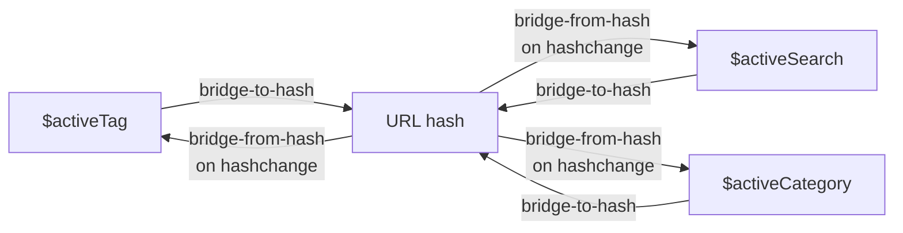
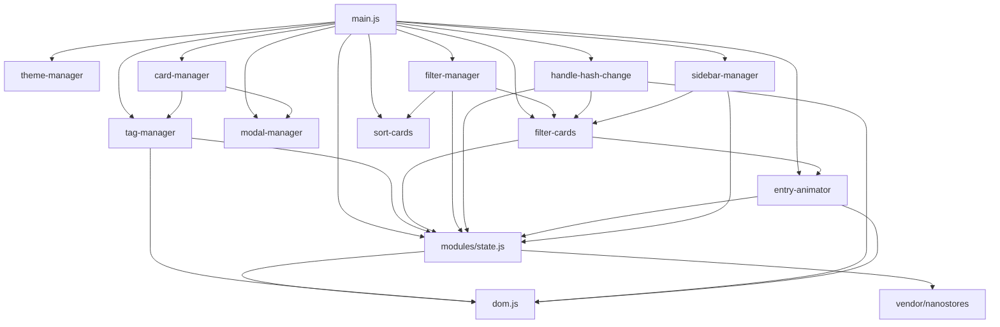

# Refactor: JavaScript State Model and Module Layout

## Introduction

`static/js/main.js` is a 1065-line monolith that mixes page detection,
state management, DOM querying, modal logic, theme persistence, sidebar
behaviour, card click handling, custom dropdown rendering, sort/filter
algorithms, entry animation, and URL-hash routing. It works, but it is
the largest source-of-fragility in the project:

- **State is implicit.** Active tag, active search, and active category
  live on the `TagManager` singleton as plain fields, mutated by methods
  that are also responsible for pushing the URL hash. There is no
  single observable place where "what filter is currently active" lives.
- **Wiring is imperative and ad hoc.** `handleHashChange()`, `filterCards()`,
  `sortCards()`, `updateResultsCount()`, and every manager's `init()`
  method call each other through the global scope. New behaviour requires
  editing multiple call sites and a `DOMContentLoaded` block that lists
  every manager in order.
- **Card visibility and animation state are interleaved with the
  IntersectionObserver logic.** The DOM class `.link-card--enter` doubles
  as the trigger for CSS animations and the marker for "this card has
  already been animated", which makes both concerns harder to reason
  about independently.
- **No reusable state primitive.** Any future feature (favourites, recent
  links, multi-step filtering) would have to invent its own ad hoc state
  container and its own URL-hash synchronisation.

This spec replaces the monolith with a small, explicit state model
backed by [Nanostores](https://github.com/nanostores/nanostores) (a
~1 KB framework-agnostic atom library), a one-module-per-concern layout,
and a round-trip-idempotent URL-hash bridge that treats the hash as a serialised
form of three filter atoms.

The refactor is **behaviour-preserving**: every user-visible feature of
the current `static/js/main.js` continues to work unchanged after the
refactor. The behaviour contract — enumerated in the Target state
section — gates the merge. No new user-visible behaviour is introduced.

## Current state

### File shape

`static/js/main.js` is 1065 lines and is loaded by `templates/base.html`
line 154 as a classic script:

```html
<script src="static/js/main.js?v={{ links.site_meta.version }}"></script>
```

It is a flat sequence of `const X = { ... }` singleton managers
(`TagManager`, `ModalManager`, `ThemeManager`, `SidebarManager`,
`CardManager`, `EntryAnimator`, `FilterManager`) followed by three
free functions (`filterCards`, `sortCards`, `handleHashChange`), each
mutating or reading the singletons through the global scope.

### State today

| Concern | Where it lives today | Mutation surface |
|---------|----------------------|------------------|
| Active tag | `TagManager.activeTag` (string, slug) | `TagManager.setActiveTag()`, `TagManager.clearActiveTag()`, direct assignment in `handleHashChange()` |
| Active search | `TagManager.activeSearch` (string) | `TagManager.setActiveSearch()`, `TagManager.clearActiveSearch()`, direct assignment in `handleHashChange()` |
| Active category | `document.getElementById('categoryFilter').value` (DOM input) | `FilterManager.bindDropdown()` click handler, `handleHashChange()` |
| Cards animated so far | Implicit: cards have the `.link-card--enter` class; `EntryAnimator` uses `IntersectionObserver.unobserve` to ensure one-shot behaviour | None — the DOM class is the state |

There is no module-level `allCards` constant. Card visibility and
animation are interleaved inside `filterCards()` (lines 816–902).

### URL hash as state

The hash carries one of three prefixes today:

| Prefix | Meaning | Example |
|--------|---------|---------|
| `#category-<id>` | Active category (from dropdown or sidebar) | `#category-frontend` |
| `#tag-<slug>` | Active tag | `#tag-python` |
| `#search-<encoded>` | Active search term | `#search-foo%20bar` |

A bare `#` (or no hash) means "no filter". Transitions are made by
direct assignment to `window.location.hash` (e.g. line 43, 63, 528, 581,
748) and consumed by the `hashchange` listener installed at line 1058
that calls `handleHashChange()`.

The existing `window.location.hash = ...` assignments **do** fire
`hashchange`. The `handleHashChange()` handler is robust to being called
twice for the same value (each method it calls is idempotent for an
unchanged input), so the current code "works" by accident — there is
no explicit loop guard.

### Entry animation

Implemented in `EntryAnimator` (lines 641–695) and replayed inside
`filterCards()` (lines 866–893) via a `classList.remove` + forced reflow
+ `classList.add` pattern. Behaviour is governed by the
`data-entry-animation` attribute on `<body>`, rendered by
`templates/base.html` line 19 from
`config.theme.effects.entry_animation`.

### Library placement

No third-party JavaScript library is used. Everything is hand-rolled
vanilla ES5-compatible code (see the `<script>` tag in `base.html`,
which has no `type="module"`).

## Target state

### State model

The runtime state of the browse page is fully described by **four
atoms**, **one computed**, and **one constant**.

| Symbol | Kind | Type | Holds | Mutated by |
|--------|------|------|-------|-----------|
| `$activeTag` | atom | `string \| null` | The slugified tag name, or `null` when no tag is active. Mutually exclusive with `$activeSearch` (exactly one is non-null at a time). | `tag-manager.setActiveTag`, `handle-hash-change`, URL-hash bridge |
| `$activeSearch` | atom | `string \| null` | The trimmed search string, or `null`. Mutually exclusive with `$activeTag`. | `tag-manager.setActiveSearch`, `handle-hash-change`, URL-hash bridge |
| `$activeCategory` | atom | `string \| null` | The active category id (matched against `data-category` on cards and the `categoryFilter` `<select>`), or `null` for "all categories". | `filter-manager.bindDropdown` click handler, `handle-hash-change`, URL-hash bridge |
| `$animatedIds` | atom | `Set<string>` | The set of card `id`s that have already received the `.link-card--enter` class this session. `EntryAnimator` adds ids on intersection; `filter-cards` consults the set to decide whether to re-play an animation on re-show. | `entry-animator` (on intersection), `filter-cards` (on re-show) |
| `$visibleCards` | computed | `string[]` | The set of card `id`s that should be visible right now, derived from `allCards` filtered by `$activeTag`, `$activeSearch`, `$activeCategory`. Recomputed by Nanostores whenever any of the three filter atoms changes. | automatic (Nanostores dependency tracking) |
| `allCards` | constant | `{ id: string, el: HTMLElement }[]` | Module-level array of `{id, el}` pairs, built once at startup by `state.js` from `document.querySelectorAll('.link-card')`. Never mutated. | none |

#### Invariants

The state model preserves the following invariants. These are the
**behaviour contract** the modules must maintain; they are not enforced
at runtime but are testable acceptance criteria.

1. **At most one of `$activeTag`, `$activeSearch`, `$activeCategory` is
   non-null at a time.** Setting one atom clears the other two.
   (Rationale: matches today's behaviour, where `setActiveTag` clears
   `activeSearch` and vice versa. Today's code does not clear
   `activeCategory` when a tag is set, but in practice the filter
   precedence is "search > tag > category", so the refactor makes this
   explicit and consistent.)
2. **`$visibleCards` is the source of truth for visibility.** All
   rendering decisions ("should this card have `display: ''` or
   `display: 'none'?") consume the computed. The DOM is then updated
   to match.
3. **`$animatedIds` only grows.** Once a card id is in the set, it
   stays in the set for the session. `EntryAnimator` checks
   `!$animatedIds.has(id)` before adding a card. Filter changes do
   not affect `$animatedIds`; the set persists across filter changes.
   The `filter-cards.js` module re-animates in-viewport visible
   cards unconditionally on filter change, which is a separate
   concern from the IO's observation memory.
4. **`allCards` is the universe of cards the JS operates on.** It is
   built once at `DOMContentLoaded` from
   `document.querySelectorAll('.link-card')` and never changes. The
   JS only reads or mutates cards in this set. Any `.link-card`
   element added to the DOM after `DOMContentLoaded` would not be
   part of the universe and would not be affected by any module's
   subscribers; this is not a concern for the current static site
   (no module adds cards dynamically), but the invariant makes the
   contract explicit so a future feature cannot accidentally rely on
   late-added cards being observed.

### URL hash as serialisation

The URL hash is a **serialised form** of the three filter atoms — a
projection of the state into a string that can live in a URL. The
bridge is bidirectional, with loop prevention via round-trip idempotence.



The cycle this would form (atom → hash → atom → hash → …) is prevented
by round-trip idempotence, not by a runtime guard. See the
[Loop prevention](#loop-prevention) subsection below.

The bridge is implemented in `state.js` as two functions:

- **`bridgeToHash(atoms)`** — subscribes to all three filter atoms. On
  change, it serialises the new values into a hash string and pushes it
  to `window.location`. The subscription **does not push a hash whose
  value is equal to the previous hash** (Nanostores' built-in equality
  short-circuit), so harmless re-firings are skipped.
- **`bridgeFromHash(apply)`** — called on `hashchange` events and on
  initial page load. Parses the hash and applies the three filter
  atoms.

#### Loop prevention

The bridge relies on **two built-in idempotence mechanisms** to prevent
the cycle. The cycle, if it were not prevented, would be:

1. User clicks: `$activeCategory.set('B')` — atom changes from `A` to `B`.
2. `bridgeToHash` fires (because the atom changed). Writes
   `location.hash = '#category-B'`.
3. Browser fires `hashchange` (because the hash changed from
   `#category-A` to `#category-B`).
4. `bridgeFromHash` parses, gets `{tag: null, search: null, category: 'B'}`.
5. `apply()` calls `$activeCategory.set('B')`. **The atom is already
   `B`**, so Nanostores' built-in `===` check skips the change and
   does not fire any subscribers.
6. `bridgeToHash` does not run again. No further `hashchange` is
   fired. The cycle terminates.

The same trace works for the initial load (where the atoms start at
their defaults and `bridgeFromHash` may change them to the URL's
filter) and for clearing the filter. In every case, the cycle
terminates after at most one full round-trip.

The actual contract that prevents the loop is **round-trip
idempotence**: parsing a hash, applying it to atoms, and
re-serialising the atoms back to a hash produces the same hash
string. As long as the parse and serialise functions are inverses,
no loop is possible — the second `bridgeToHash` write is either
skipped (because the atom is already at the right value) or it
writes the same string the browser already has (which the browser
will not re-fire `hashchange` for).

A future change that breaks this idempotence — e.g., a hash format
that encodes atoms in a way that does not round-trip (different
canonical forms of the same value), or a serialisation that
normalises the hash differently from the parser — would re-introduce
the cycle. The spec calls this out in the "Open questions / risks"
section: any such change must preserve round-trip idempotence, or
an explicit guard would be needed.

#### Initial state

On `DOMContentLoaded`:
1. `state.js` runs first: it creates the four atoms, the `allCards`
   constant, and the `$visibleCards` computed.
2. `state.js` calls `bridgeFromHash(apply)` **once** to consume the
   initial URL hash. If the URL has a filter, the atoms change from
   their defaults; `bridgeToHash` then fires and writes the same
   hash back, but the URL is already that value, so the browser does
   not re-fire `hashchange`. If the URL has no filter, the atoms stay
   at their defaults and no subscribers fire at all.
3. `state.js` then calls `bridgeToHash()` to install the subscriptions
   for any subsequent atom changes.
4. Other modules then `init()` themselves and may also call
   `bridgeFromHash` (for example, `handle-hash-change.js` does so on
   the explicit `hashchange` event). Each call relies on the same
   round-trip idempotence to avoid loops.

### Module layout

```
static/js/
├── main.js                     (~30 lines: imports, page detection, DOMContentLoaded boot)
├── dom.js                      (DOM manifest: cached element references for repeated queries)
├── modules/
│   ├── state.js                (atoms, computed, allCards, bridge)
│   ├── tag-manager.js          (search input, suggestions, slugify; writes to $activeTag / $activeSearch)
│   ├── modal-manager.js        (open/close modal, keyboard, share button)
│   ├── theme-manager.js        (data-theme toggle with localStorage persistence)
│   ├── sidebar-manager.js      (toggle, overlay, category accordion, subcategory links)
│   ├── card-manager.js         (click/keydown on .link-card, .card-tags .tag click)
│   ├── entry-animator.js       (IntersectionObserver + scroll safety net; reads/writes $animatedIds)
│   ├── filter-manager.js       (custom dropdown binding; writes to $activeCategory)
│   ├── filter-cards.js         (reads $visibleCards, applies display:none, re-animates reshown)
│   ├── sort-cards.js           (reorders DOM by newest/oldest/alphabetical)
│   └── handle-hash-change.js   (parses hash, dispatches to atoms + side-effects)
└── vendor/
    └── nanostores.js           (generated by js_vendor.py at build time; gitignored)
```

#### Module responsibilities (one-line each)

| Module | Exports | Responsibility |
|--------|---------|----------------|
| `main.js` | (none — entry point) | Imports modules, runs `isBrowsePage` detection, wires `DOMContentLoaded`. |
| `dom.js` | `dom.<elementName>` references | Cached `getElementById` results. Created once, shared across modules. |
| `modules/state.js` | `$activeTag`, `$activeSearch`, `$activeCategory`, `$animatedIds`, `$visibleCards`, `allCards`, `bridgeToHash`, `bridgeFromHash` | State primitives + URL-hash bridge. |
| `modules/tag-manager.js` | `TagManager` | Search input event handling, suggestion rendering, click/keyboard navigation, slugify. |
| `modules/modal-manager.js` | `ModalManager` | Open/close modal, Esc, click-outside, share-button clipboard. |
| `modules/theme-manager.js` | `ThemeManager` | `data-theme` toggle with `localStorage` persistence. |
| `modules/sidebar-manager.js` | `SidebarManager` | Sidebar toggle, mobile overlay, category accordion, subcategory link clicks. |
| `modules/card-manager.js` | `CardManager` | Click/keyboard on `.link-card`; click on `.card-tags .tag`. |
| `modules/entry-animator.js` | `EntryAnimator` | IntersectionObserver + scroll safety net for `.link-card--enter`. Reads/writes `$animatedIds`. |
| `modules/filter-manager.js` | `FilterManager` | Custom category/sort dropdown binding. Click on option writes `$activeCategory` and calls `filterCards` / `sortCards`. |
| `modules/filter-cards.js` | `filterCards` | Reads `$visibleCards`, sets `card.style.display`, re-animates reshown cards. |
| `modules/sort-cards.js` | `sortCards` | Reorders the `.link-card` DOM nodes by selected sort key. |
| `modules/handle-hash-change.js` | `handleHashChange` | `hashchange` event handler. Calls `bridgeFromHash`; updates sidebar expanded state, dropdown selection, filter header. |
| `vendor/nanostores.js` | nanostores API | Vendored third-party state library. See [Library placement](#library-placement-vendoring). |

#### `main.js` shape

The new `main.js` is a slim bootstrap. It is the only file loaded
directly by `base.html`. It does not contain logic — it imports the
modules and wires the lifecycle:

- Detects landing vs. browse page (same `pathname.includes('browse.html')` check as today).
- On `DOMContentLoaded`:
  1. Import (or call) `state.js` to initialise atoms + bridge.
  2. Call `TagManager.init()`, `ThemeManager.init()`, `SidebarManager.init()`, `CardManager.init()`, `EntryAnimator.init()` — same set of managers as today, in the same order.
  3. If on browse page, call `FilterManager.init()`, call `handleHashChange()` once, and install the `hashchange` listener.
  4. Call `ModalManager.init()`.

The `updateResultsCount()` free function in the current file (lines
1036–1042) is folded into `filter-cards.js` (it already runs at the
end of `filterCards()` in the current code).

#### Inter-module dependencies



`main.js` is the only file that touches every other module. Inside the
modules, the dependency graph is shallow: `state.js` is the only module
imported by more than one other module.

### Library placement (vendoring)

Nanostores (~1 KB minified, single ESM file) is the only third-party
JavaScript dependency. It is vendored into the repository at build
time using the same pattern as `font_acquirer.py` and
`image_acquirer.py` — a pure-Python downloader that reads a version pin
from a manifest and writes a file into `static/`.

There is **no Node toolchain** involved at any point. No `npm install`,
no `package-lock.json`, no `node_modules/`. The `package.json` file at
the repo root is a **manifest only** — it is read by `js_vendor.py` and
nothing else.

#### Files

| Path | Committed? | Purpose |
|------|-----------|---------|
| `package.json` | yes | Manifest: declares `nanostores` version. Read by `js_vendor.py`. |
| `src/resourcery_ssg/js_vendor.py` | yes | Python downloader. Reads `package.json`, fetches from unpkg, writes to `static/js/vendor/nanostores.js`. |
| `static/js/vendor/nanostores.js` | **no** (gitignored) | Generated at build time. The vendored library file. |
| `.gitignore` | yes | Has one new line: `static/js/vendor/` (the entire directory is ignored). |

#### `package.json` (committed)

```json
{
  "name": "resourcery-ssg-js",
  "private": true,
  "type": "module",
  "dependencies": {
    "nanostores": "0.11.4"
  }
}
```

| Field | Why it is set |
|-------|---------------|
| `name: "resourcery-ssg-js"` | Distinguishes this manifest from any future package the project might depend on. GitHub, IDEs, and any tooling that auto-detects `package.json` will not mistake it for a publishable package. |
| `private: true` | Reinforces the same point; npm refuses to publish a private package by default. |
| `type: "module"` | Establishes ESM as the project-wide convention (the browser uses `<script type="module">`; any future Node-side tool like Vitest can read the same intent). |
| `dependencies.nanostores: "0.11.4"` | The single source of truth for which Nanostores version we depend on. `js_vendor.py` reads this exact key. |

The `package.json` is **not** a lock file and does not need to be
deterministic. It is a version pin. There is no `package-lock.json` and
no `node_modules/`.

#### `js_vendor.py` (committed, new)

A new file at `src/resourcery_ssg/js_vendor.py`. Modeled directly on
`font_acquirer.py`. Its full behaviour:

1. Read `package.json` from the repo root using `json` (stdlib).
2. Extract `dependencies["nanostores"]` (a version string).
3. Construct the source URL
   `https://unpkg.com/nanostores@<version>/nanostores.esm.js`.
4. Check the first line of `static/js/vendor/nanostores.js`. If it
   matches `/* nanostores <version> source: <url> acquired: <iso-date> */`
   with the same `<version>`, **no-op** (the file is already current).
5. Otherwise: download from unpkg with `urllib.request`, prepend the
   header comment, write to `static/js/vendor/nanostores.js`. Create
   the parent directory if needed.

The script is **idempotent**: re-running it with an unchanged
`package.json` is a no-op, regardless of network availability. Network
is only contacted when the version pin changes or the file is missing.

`urllib.request` is used (not `requests`). The rationale:

- `urllib.request` is already used by `font_acquirer.py` for the
  equivalent download, so the project has the precedent.
- The download is one ~1 KB file, so `requests` brings no benefit.
- Using stdlib means no new `pyproject.toml` dependency is needed for
  this spec.

A CLI entry point is added to `pyproject.toml`:
`acquire-js = "resourcery_ssg.js_vendor:main"`. The naming matches the
existing `acquire-fonts` and `acquire-images` scripts (see [Open
questions / risks](#open-questions--risks) for the alternative name
`vendor-js`).

#### `static/js/vendor/nanostores.js` (generated, gitignored)

Created at build time by `js_vendor.py`. Loaded as an ES module by
`state.js`:

```js
import { atom, computed } from './vendor/nanostores.js';
```

The vendor file's first line carries the header comment, e.g.:

```
/* nanostores 0.11.4 source: https://unpkg.com/nanostores@0.11.4/nanostores.esm.js acquired: 2026-07-30 */
```

This header is the only way the version is tracked. A future hardening
(see [Open questions / risks](#open-questions--risks)) could add a
SHA-256 check next to the version.

#### `.gitignore` (modified)

One new line is added:

```
static/js/vendor/
```

The entire `static/js/vendor/` directory is gitignored. The directory
is created at build time and is not part of the source tree.

#### Build pipeline change

The build pipeline (documented in `CONTRIBUTING.md` lines 200–232)
gains one new step. The new order:

```
Step 1: src/resourcery_ssg/validate.py
Step 2: src/resourcery_ssg/font_acquirer.py
Step 3: src/resourcery_ssg/js_vendor.py        (NEW)
Step 4: src/resourcery_ssg/image_acquirer.py   (optional)
Step 5: src/resourcery_ssg/build.py
```

`js_vendor.py` runs **after** `font_acquirer.py` (so font acquisition
still gates the build) and **before** `build.py` (so the vendored file
exists on disk by the time `build.py`'s `shutil.copytree` copies
`static/js/` to `output/static/js/`). The existing copy step at
`build.py` lines 297–300 already copies the whole `static/js/`
directory verbatim; the vendored file rides along.

The `site.py` coordinator's `all` subcommand is updated to include the
new step.

### Behaviour contract

This refactor is **behaviour-preserving**. Every user-visible feature
of the current `static/js/main.js` continues to work unchanged after
the refactor. The table below enumerates the feature areas that must
remain functional. Each row is a **contract** — the refactor only
restructures the code that implements it; it does not change what the
user sees or can do.

| Feature area | User-visible surface |
|--------------|----------------------|
| **Browse-page filter system** | Category dropdown, sort dropdown, hash deep-linking, URL round-trip. |
| **Search** | Search input, suggestions, keyboard navigation, `#search-` URL routing. |
| **Tag system** | Active tag, sidebar tag clicks, card tag clicks, `#tag-` URL routing. |
| **Card grid** | Visibility (show/hide on filter), sort (newest/oldest/alphabetical), no-results state, count display. |
| **Modal** | Open on card click, close on Esc/click-outside, content from `data-*` attributes, share button. |
| **Theme** | Dark/light mode toggle, `localStorage` persistence, `<html data-theme>` attribute. |
| **Sidebar** | Toggle, mobile overlay, category accordion, subcategory link clicks, mobile auto-close. |
| **Entry animation** | Scroll-triggered reveal via `IntersectionObserver`, re-animation on filter, four enum values (`none`, `fade`, `slide-up`, `fade-slide-up`), `prefers-reduced-motion` respect. |
| **Hash routing** | Parse on load, react to `hashchange`, write on filter change, browser back/forward works. |

Each item in this table is a contract, not new behaviour. The refactor
restructures the code that implements these surfaces; it does not
introduce or remove any. Where a feature has its own dedicated spec —
e.g. the entry-animation feature is documented in detail in
[`specs/feats/card_entry_animation.md`](../feats/card_entry_animation.md)
— that spec's acceptance criteria are an explicit subset of the
corresponding contract row above. The entry animation is **one** of
these contracts (it is not the singular focus of this refactor); it
is referenced by name here only because it was the original driver
for restructuring the JS state model.

### Migration strategy

The refactor is a **big-bang**: a single commit replaces the 1065-line
`static/js/main.js` with the new `main.js` + the `modules/` directory +
the vendored library, and updates `templates/base.html` to load the
new bootstrap as a module.

Justification:

- The old and new architectures are **not interoperable**. The old
  file attaches managers to the global scope (`window.TagManager`, etc.)
  and the new file imports from ES modules. Running both side by side
  would cause name collisions and double-init bugs.
- The big-bang commit is small in **diff** even if it is large in
  **lines added** (the 1065-line old file is deleted; ~1000 lines of
  new code are added across ~14 files). The new code is purely
  rearranging existing behaviour, so the actual behaviour delta is
  minimal and reviewable in one pass.
- The behaviour contract (enumerated in the Target state section)
  gates the merge: every feature listed there must continue to work
  on the refactored build.
- The build is broken for the duration of the commit (the new
  `main.js` requires ES modules, which require `<script
  type="module">`). This is acceptable for a solo project with no
  active users between commits.

### Toolchain

The build remains a pure Python toolchain. The dependency tree after
this spec is:

- **Build-time Python:** unchanged. `poetry install` produces the
  environment that runs `validate.py`, `font_acquirer.py`,
  `js_vendor.py`, `image_acquirer.py`, `build.py`, `site.py`. The
  `pyproject.toml` adds one new `[tool.poetry.scripts]` entry
  (`acquire-js`) and no new `[tool.poetry.dependencies]` entry.
- **Build-time Node:** **none**. `js_vendor.py` is pure Python
  (stdlib `json`, stdlib `urllib.request`, stdlib `pathlib`). It
  downloads one ~1 KB file from unpkg. There is no `npm install`, no
  `node_modules/`, no Node binary on the build host.
- **Runtime browser:** the generated site has one new HTTP request per
  page (`static/js/vendor/nanostores.js`, ~1 KB). The site remains
  zero-runtime-dependency in the sense that no third-party CDN is
  contacted at page-view time; the vendored file is served from the
  same origin.
- **CI / CI host:** the same `poetry install && poetry run build`
  invocation as today. CI hosts do not need Node installed.

The build is still a five-step pipeline:

```
validate → font_acquirer → js_vendor → image_acquirer → build
```

## Design decisions

1. **Nanostores, not Redux / Zustand / Pinia.** Nanostores is the
   smallest viable state primitive for this app: atoms, computeds,
   framework-agnostic. Redux's reducer ceremony and Zustand's
   React-binding are not warranted for a four-atom app.

2. **Big-bang migration, not gradual.** See [Migration
   strategy](#migration-strategy). The old and new architectures are
   not interoperable; a phased migration would require maintaining two
   parallel state systems, which is strictly worse than a single
   well-tested commit.

3. **`$animatedIds` as an atom, not a plain `Set`.** A plain `Set` in
   a closure would work, but having it as an atom lets
   `entry-animator.js` and `filter-cards.js` observe it independently
   without sharing a module reference, and it makes the "this card has
   already been animated" decision reactive in the same model as
   everything else.

4. **One source of truth for category: the atom, not the `<select>`.**
   Today's code reads `categoryFilter.value` directly inside
   `filterCards()`. In the refactor, `$activeCategory` is the truth;
   `FilterManager` and `handle-hash-change` both write to it, and
   `filter-cards` reads it. The `<select>`'s value is updated as a
   *side effect* of the atom changing (an effect in the
   bridgeFromHash / `handle-hash-change` call sites), so the dropdown
   always reflects the atom.

5. **`urlib.request`, not `requests`.** Stdlib is sufficient for one
   ~1 KB file. Keeps the pattern identical to `font_acquirer.py` and
   adds no `pyproject.toml` dependency.

6. **`package.json` is a manifest, not a build tool.** The fact that
   `package.json` is "the" file for Node projects is incidental. Here
   it is just a JSON file with a single number; `js_vendor.py` is the
   only thing that reads it. The project does not become a Node
   project.

7. **`static/js/vendor/` gitignored, not committed.** Vendored binaries
   (fonts, images) are already gitignored. Following the existing
   pattern keeps the repository size small and lets the user
   reproduce the vendored file deterministically from the
   `package.json` pin.

8. **No integrity hash for the first cut.** The version pin + unpkg
   URL is the trust model. A SHA-256 check can be added later as a
   follow-up; for a ~1 KB library, the cost of a missed integrity
   check is negligible. See
   [Open questions / risks](#open-questions--risks).

9. **JSDoc and `@ts-check` deferred to a follow-up spec.** The new
   modules are written in plain ES6+ JavaScript with no JSDoc type
   annotations and no `// @ts-check` pragma. A follow-up spec will
   add type annotations and a `tsc --noEmit --allowJs --checkJs` check
   to the build pipeline. This is a separate, well-scoped change
   that benefits from a settled module layout.

10. **Vitest deferred to a follow-up spec.** No test setup is included
    in this refactor. The general non-regression AC 9 is the manual
    test surface for this commit. A follow-up spec will add Vitest
    with a jsdom environment, reuse the existing `tests/fixtures/`
    directory, and test each module in isolation. Deferring avoids
    making this PR depend on a Vitest + jsdom evaluation, which is a
    separate, less-mature decision than the module layout itself.

11. **The previous draft's "Library placement" / vendoring section
    is fully replaced.** The previous draft proposed committing the
    vendored file directly. That proposal was rejected after
    discussion in favour of the `package.json` + `js_vendor.py`
    pattern above. No trace of the rejected approach remains in this
    spec.

## Open questions / risks

1. **Network at first build.** A fresh clone needs network access on
   the **first** `poetry run build` to download
   `nanostores.esm.js` from unpkg. This matches the existing
   behaviour for Google Fonts and link images (see
   `font_acquirer.py` and `image_acquirer.py`). A pure-offline build
   is not a property the project currently has for any asset, so it
   is not a property we need to add for JS. The vendored file is
   stable thereafter until the next version bump.
   **Status:** acceptable, matches existing pattern. Documented in
   AC 6.

2. **Bumping a dependency.** Updating Nanostores is a 1-line edit to
   `package.json` + `poetry run acquire-js` + commit. The build then
   picks up the new file. The same workflow applies to any future
   JS dependency added to `package.json`. This is the documented
   workflow, no open question. (If the team would prefer an explicit
   `bump` subcommand or a pre-commit hook, that is a follow-up
   convenience, not a blocker.)

3. **Idempotency by header-comment match.** `js_vendor.py` checks the
   first line of `static/js/vendor/nanostores.js` against the version
   pin in `package.json`. If upstream changes the file's contents but
   keeps the version the same, the script will not re-download. For
   a 1 KB file with a fixed version pin, this is an acceptable risk.
   A future hardening (e.g. a SHA-256 column next to the version in
   the header) can close this gap; that is a follow-up spec, not a
   blocker for this one.

4. **CLI script name: `acquire-js` or `vendor-js`?** This spec
   proposes `acquire-js` for consistency with `acquire-fonts` and
   `acquire-images`. The earlier conversation used `vendor-js`. Both
   are reasonable. The planner should pick one and the spec is
   unaffected by the choice; the existing files use the `acquire-`
   prefix, so `acquire-js` is the default.

5. **What if `package.json` is missing the `nanostores` key?**
   `js_vendor.py` exits with a clear error. Documented in the
   error-handling table below.

6. **What if unpkg is unreachable?** `js_vendor.py` propagates the
   network error and exits non-zero. The build fails loudly. The
   user re-runs the build when network is back; the previously
   downloaded `nanostores.js` (if any) is **not** deleted on
   failure, so a transient network error does not corrupt the
   vendored file.

7. **What if the static site is built once and then served from a
   different network?** The vendored `nanostores.js` is copied into
   `output/static/js/vendor/` by `build.py` and is served from the
   same origin as the rest of the site. There is no runtime CDN
   dependency.

8. **Pre-existing `updateResultsCount` folded into `filter-cards`.**
   The current file has a free function `updateResultsCount()` (lines
   1036–1042) that is only called from the commented-out
   `// updateResultsCount();` at line 1062. The function is dead code.
   The refactor deletes it. (Its job is already done by the end of
   `filterCards()`, which updates `resultsCount` directly.) Flag this
   in case the user wants to keep the function as a public utility.

9. **`main.js` becomes an ES module.** Today's `<script>` tag has no
   `type="module"`. The new `<script type="module">` defers
   execution and changes the loading semantics slightly (modules are
   deferred by default; inline scripts run before deferred modules).
   The build pipeline already uses `defer` semantics for everything
   that matters, so no behaviour change. Flag this for the planner
   to verify.

10. **Will the JSDoc/Vitest follow-ups land soon?** Out of scope for
    this spec, but if they are scheduled to arrive quickly, the
    planner should know — they affect how aggressively to use
    ES-module-only features in the new code (e.g. private class
    fields, top-level await).

11. **Round-trip idempotence of the URL-hash bridge.** The
    loop-prevention design relies on the hash parse and serialise
    functions being inverses: `parse(serialise(atoms)) === atoms` and
    `serialise(parse(hash)) === hash`. The current design satisfies
    this trivially because the hash format is a single token
    (`#category-<id>`, `#tag-<slug>`, or `#search-<encoded>`) and
    invariant 1 guarantees at most one filter atom is non-null at a
    time, so the serialise function picks the one non-null atom and
    emits its token. A future change that introduces a hash format
    that does not round-trip (e.g., encoding multiple filters
    simultaneously, or normalising tags to a canonical form that the
    parser does not reverse) would re-introduce the loop. Any such
    change must preserve round-trip idempotence, or an explicit
    guard (the originally-proposed `isApplyingFromHash` flag, or an
    unobserve/observe pattern) would be needed. The spec's
    "Loop prevention" subsection in the URL-hash section calls this
    out as the contract.

#### Resolved (vs. previous draft)

The following were open in the previous draft and are now resolved:

- ~~Library placement~~ — vendoring via `package.json` + `js_vendor.py`.
- ~~Vitest setup~~ — deferred to a follow-up spec.
- ~~Pin the Nanostores version~~ — pinned in `package.json`, enforced
  by `js_vendor.py` idempotency check.
- ~~Bundle size of vendored file~~ — confirmed ~1 KB; matches the
  existing zero-runtime-dependency philosophy.

## Acceptance criteria

### Vendoring ACs (this spec's scope)

1. **`package.json` is committed with the four required fields.** The
   repo root has a `package.json` with `name: "resourcery-ssg-js"`,
   `private: true`, `type: "module"`, and
   `dependencies: { "nanostores": "<version>" }` where `<version>` is
   a non-empty string. `git ls-files --error-unmatch package.json`
   exits 0. `cat package.json` parses as valid JSON.

2. **The vendored file is gitignored and generated at build time.**
   `git check-ignore static/js/vendor/nanostores.js` exits 0. The
   file does not exist in any commit (verify with
   `git log --all --oneline -- static/js/vendor/` returning empty
   history or, equivalently, the file is not in any tree). After a
   clean `poetry run acquire-js`, the file exists at
   `static/js/vendor/nanostores.js` with a first-line header comment
   `/* nanostores <version> source: https://unpkg.com/... acquired: <iso-date> */`.

3. **`js_vendor.py` is idempotent.** Running `poetry run acquire-js`
   twice in a row with no changes to `package.json` produces no
   network traffic on the second run (the script short-circuits on
   the header check). The vendored file is unchanged between the
   two runs (same mtime, same content, same size).

4. **`.gitignore` contains `static/js/vendor/`.** `git check-ignore
   static/js/vendor/nanostores.js` exits 0; `git check-ignore
   static/js/vendor/anything.js` exits 0.

5. **The build pipeline includes `js_vendor.py` as a step.** The
   `site all` subcommand runs
   `validate → acquire-fonts → acquire-js → acquire-images → build`
   in that order. `poetry run site all` produces a working
   `output/` with `output/static/js/vendor/nanostores.js` present
   and `output/static/js/main.js` present as an ES module
   (verify by inspecting the `build` step's `shutil.copytree` call
   on `static/js/`).

6. **Fresh clone + first build produces a working `output/`.** A
   clean checkout followed by `poetry install && poetry run build`
   produces `output/index.html`, `output/browse.html`,
   `output/static/css/style.css`, `output/static/js/main.js`, and
   `output/static/js/vendor/nanostores.js`. The **first** build
   requires network access (to download Nanostores from unpkg);
   subsequent builds with no `package.json` change do not.

7. **No Node toolchain required at any point.** `which node` returns
   non-zero in a fresh environment; the build still succeeds. There
   is no `node_modules/` directory in the repo. There is no
   `package-lock.json` in the repo. `pyproject.toml` gains only one
   new `[tool.poetry.scripts]` entry (`acquire-js`); the
   `[tool.poetry.dependencies]` table is unchanged.

8. **`<script>` becomes `<script type="module">` in `base.html`.**
   The diff to `templates/base.html` is exactly: one line changed
   from `<script src="static/js/main.js?...">` to
   `<script type="module" src="static/js/main.js?...">`. No other
   changes to the template.

### Non-regression AC (behaviour contract)

9. **All existing user-visible functionality is preserved.** Manual
   smoke testing of the browse page confirms that every feature
   listed in the "Behaviour contract" subsection of the Target state
   section continues to work as it did before the refactor. This
   includes (but is not limited to) filter, sort, modal, dark mode,
   sidebar, search suggestions, entry animation on scroll and on
   filter, URL hash deep-linking (`#category-x`, `#tag-y`,
   `#search-z`), and browser back/forward. The four behaviour-
   shaping acceptance criteria of
   [`specs/feats/card_entry_animation.md`](../feats/card_entry_animation.md)
   (default, scroll-triggered, re-animation on filter, all four enum
   values) are an explicit subset of this AC and must pass.

## Related specs

### Preserves

- [`specs/feats/card_entry_animation.md`](../feats/card_entry_animation.md) — the entry-animation behaviour implemented in the current `static/js/main.js`. This refactor preserves all four behaviour-shaping ACs of that spec as an explicit subset of the general "behaviour contract" in the Target state section.

### Depends upon

- (none — all the building blocks used by this refactor are already
  in the codebase: the design token system, the card data layer, the
  URL-hash routing pattern, the `font_acquirer.py` pattern that
  `js_vendor.py` mirrors.)

### See also

- [specs/refactors/src_layout_package.md](src_layout_package.md) —
  the precedent for "one concern per Python module" and the
  `[tool.poetry.scripts]` registration pattern. `js_vendor.py`
  follows the same shape.
- [specs/refactors/path_configurability.md](path_configurability.md) —
  the config system (`config.yaml`, `load_resourcery_config()`,
  `${VAR}` resolution) that `js_vendor.py` could later opt into if
  output paths need to be configurable. For the first cut,
  `js_vendor.py` reads `package.json` from the repo root and writes
  to `static/js/vendor/nanostores.js` — both fixed paths — so the
  config layer is not required.
- [specs/refactors/design_token_system.md](design_token_system.md) —
  the motion tokens (`--motion-duration`, `--motion-easing`)
  consumed by `entry-animator.js` and the CSS it triggers.

### Enables (planned follow-ups, not yet written)

- A follow-up spec to add JSDoc type annotations and `// @ts-check`
  to the new `modules/`, with `tsc --noEmit --allowJs --checkJs` as
  a build step.
- A follow-up spec to add Vitest with a jsdom environment, testing
  each module in isolation. The general non-regression AC 9 of this
  spec is the obvious first test target.

## Technical details

### `js_vendor.py` shape

The script follows the `font_acquirer.py` shape. The
`acquire_js(*, package_json_path, vendor_dir)` entry point accepts
both paths as keyword arguments for testability, and a `main()` parses
CLI flags. The `pyproject.toml` registration is:

```toml
[tool.poetry.scripts]
acquire-js = "resourcery_ssg.js_vendor:main"
```

`package_json_path` defaults to the repo root `package.json`
(located via `Path(__file__).resolve().parent.parent.parent.parent`,
i.e. four levels up from the script). `vendor_dir` defaults to
`./static/js/vendor/`.

### Error table for `js_vendor.py`

| Condition | Behaviour |
|-----------|-----------|
| `package.json` missing | Exit non-zero with `Error: package.json not found at <path>`. |
| `package.json` is not valid JSON | Exit non-zero with `Error: package.json is not valid JSON: <reason>`. |
| `dependencies.nanostores` missing from `package.json` | Exit non-zero with `Error: package.json has no dependencies.nanostores entry`. |
| unpkg unreachable | Exit non-zero with `Error: failed to download <url>: <reason>`. Vendored file (if any) is left untouched. |
| Vendored directory not writable | Exit non-zero with `Error: cannot write to <vendor_dir>: <reason>`. |
| Vendored file exists with different version | Re-download, overwrite with the new version. The previous file is not backed up (idempotency guarantees a clean rebuild from the pin). |

### Bridge code-shape sketch (for the planner's reference)

`state.js` exports the atoms, the computed, `allCards`, and the two
bridge functions. The bridge is the only place the URL-hash string
format is constructed or parsed; every other module consumes the
atoms directly.

### `entry-animator.js` consults `$animatedIds`

The current code uses `classList.contains('link-card--enter')` as a
proxy for "already animated". The refactor uses
`$animatedIds.has(cardId)` instead, so the boolean is not coupled to
the DOM class. The class is still added/removed to drive the CSS
animation, but the *decision* to animate is atom-driven.

Note the separation of concerns with `filter-cards.js`: the IO uses
`$animatedIds` purely as observation memory — it checks the set to
decide whether a card has *already* been animated, and `unobserve`s
the card to prevent re-observation on subsequent scrolls.
`filter-cards.js`, by contrast, does **not** consult `$animatedIds`
at all; on a filter change it unconditionally re-applies the reflow
trick to every in-viewport visible card, including cards that the
IO had never observed before. The two mechanisms coexist:
`$animatedIds` enforces "do not re-animate on scroll", and
`filter-cards.js` enforces "do re-animate on filter, even for
previously-unobserved in-viewport cards". Conflating the two would
regress the filter behaviour.

### `filter-cards.js` re-animates all in-viewport visible cards on filter change

`filter-cards.js` does **not** consult `$animatedIds`. The two
concerns are deliberately separated: `$animatedIds` is the
IntersectionObserver's observation memory (see the
`entry-animator.js` subsection above), while filter re-animation is
a separate mechanism that does its own work.

On a filter change, the module mirrors the current `main.js`
behaviour (lines 866–893): for every card that becomes visible
(`display: ''`), the code unconditionally removes
`.link-card--enter`, computes the card's bounding rect, and pushes
in-viewport cards into a `reshownCards` list. After the loop
completes, the code forces a single reflow (`void
document.body.offsetWidth`) and re-adds `.link-card--enter` to each
card in `reshownCards`, causing the CSS animation to replay for
those cards only. Below-fold cards are left without the class
(`display: ''` but `.link-card--enter` absent) so the
IntersectionObserver reveals them as the user scrolls to them.

The user-visible contract is the four behaviour-shaping acceptance
criteria of
[`specs/feats/card_entry_animation.md`](../feats/card_entry_animation.md):

- **AC 2 (no re-animation on scroll):** enforced by the IO +
  `$animatedIds`. The IO adds the card id to `$animatedIds` on
  first intersection and immediately `unobserve`s the card, so
  the IO never fires again for it. Scrolling past an already-animated
  card is a no-op.
- **AC 3 (re-animation on filter):** enforced by `filter-cards.js`'s
  unconditional reflow trick for in-viewport cards. This includes
  cards that have never been in the viewport before (e.g. cards
  that become visible because a filter change swapped them in above
  the fold). The refactor must **not** gate the reflow trick on
  `$animatedIds` — doing so would silently regress the "filter
  reveals new in-viewport cards with an animation" behaviour for
  cards that the IO had not yet observed.

### `static/js/main.js` size budget

Target: ~30 lines, no business logic. The file imports modules, sets
up the `DOMContentLoaded` handler, and exits.

### `static/js/modules/` aggregate size budget

The 12 modules should total to roughly the same line count as the
old `main.js` (1065 lines), plus a small overhead for module
boundaries (~10–20% is reasonable). The refactor is not a
line-reduction exercise; it is a separation-of-concerns exercise.
Excessive growth (>1300 lines across `modules/`) should be a signal
that a module has absorbed responsibility that belongs elsewhere.

### `package.json` is *not* in the `data/` flow

`package.json` is committed at the repo root and is not part of the
site's input data. It is not validated, not read by `validate.py`,
not templated, and not user-editable per site. It is a build-tool
manifest, like `pyproject.toml`.

### Build pipeline order (after this spec)

| Step | Script | Network? | Output |
|------|--------|----------|--------|
| 1 | `validate.py` | no | console |
| 2 | `font_acquirer.py` | yes (first run / version bump) | `static/fonts/`, `static/css/fonts.css` |
| 3 | `js_vendor.py` | yes (first run / version bump) | `static/js/vendor/nanostores.js` |
| 4 | `image_acquirer.py` | yes (first run / per link) | `static/images/acquired/` |
| 5 | `build.py` | no | `output/` |

The first build requires network for steps 2, 3, and 4. Subsequent
builds with no asset changes skip the network (each acquirer has
cache-detection logic, including the new `js_vendor.py`).

### `static/js/` after this spec

```
static/js/
├── main.js                     # ~30 lines, ES module bootstrap
├── dom.js                      # DOM manifest (cached element references)
├── modules/                    # 12 modules, see Module layout
│   ├── state.js
│   ├── tag-manager.js
│   ├── modal-manager.js
│   ├── theme-manager.js
│   ├── sidebar-manager.js
│   ├── card-manager.js
│   ├── entry-animator.js
│   ├── filter-manager.js
│   ├── filter-cards.js
│   ├── sort-cards.js
│   └── handle-hash-change.js
└── vendor/                     # gitignored, generated
    └── nanostores.js
```

## Files touched

Every file this spec creates, modifies, or deletes. "Generated" means
the file exists on disk after a build but is not part of the source
tree.

| Path | Status | Description |
|------|--------|-------------|
| `package.json` | new, committed | JS dependency manifest. Contains the `nanostores` version pin. Read by `js_vendor.py`. |
| `src/resourcery_ssg/js_vendor.py` | new, committed | Pure-Python downloader. Reads `package.json`, downloads from unpkg, writes to `static/js/vendor/nanostores.js`. Idempotent via header-comment check. |
| `static/js/vendor/nanostores.js` | new, generated, gitignored | Vendored Nanostores ESM file. Created at build time by `js_vendor.py`. Not in any git tree. |
| `static/js/main.js` | replaced (was 1065 lines → ~30 lines), committed | Slim ES-module bootstrap. Imports the modules, runs `DOMContentLoaded` boot. The previous file is deleted; this is a rewrite, not a rename. |
| `static/js/dom.js` | new, committed | DOM manifest. Cached references to elements that are queried more than once across modules. |
| `static/js/modules/state.js` | new, committed | Defines the four atoms, the `$visibleCards` computed, the `allCards` constant, and the `bridgeToHash` / `bridgeFromHash` URL-hash bridge (with round-trip idempotence as the loop-prevention contract). |
| `static/js/modules/tag-manager.js` | new, committed | Search input, suggestions, slugify. Reads/writes `$activeTag`, `$activeSearch`. |
| `static/js/modules/modal-manager.js` | new, committed | Modal open/close, keyboard, share button. No state atoms touched. |
| `static/js/modules/theme-manager.js` | new, committed | `data-theme` toggle with `localStorage` persistence. No state atoms touched. |
| `static/js/modules/sidebar-manager.js` | new, committed | Sidebar toggle, mobile overlay, category accordion. Writes to `$activeCategory` via the URL-hash path. |
| `static/js/modules/card-manager.js` | new, committed | Click/keydown on `.link-card` and `.card-tags .tag`. No state atoms touched directly. |
| `static/js/modules/entry-animator.js` | new, committed | IntersectionObserver + scroll safety net. Reads/writes `$animatedIds`. |
| `static/js/modules/filter-manager.js` | new, committed | Custom category/sort dropdown binding. Writes to `$activeCategory`. |
| `static/js/modules/filter-cards.js` | new, committed | Reads `$visibleCards`, applies `display`, re-animates reshown cards. |
| `static/js/modules/sort-cards.js` | new, committed | Reorders the `.link-card` DOM nodes by selected sort key. |
| `static/js/modules/handle-hash-change.js` | new, committed | `hashchange` event handler. Calls `bridgeFromHash`; updates sidebar expanded state, dropdown selection, filter header. |
| `templates/base.html` | modified, committed | One-line change: `<script src="static/js/main.js?...">` → `<script type="module" src="static/js/main.js?...">`. No other changes. |
| `.gitignore` | modified, committed | One-line addition: `static/js/vendor/`. The directory is ignored. |
| `pyproject.toml` | modified, committed | One-line addition: `acquire-js = "resourcery_ssg.js_vendor:main"` under `[tool.poetry.scripts]`. The `[tool.poetry.dependencies]` table is **unchanged** (no new Python deps; `urllib.request` from stdlib is sufficient). |
| `CONTRIBUTING.md` | modified, committed | Update the "File / Folder Roles" table (add `js_vendor.py`, update `static/js/main.js` row, add a row for the new modules directory). Update the "Build Pipeline" diagram (insert step 3). Update the "Tracked" / "What Is Tracked / Ignored" section (add `static/js/vendor/` to the ignored list, mention `package.json` is tracked and is a JS dependency manifest). |
