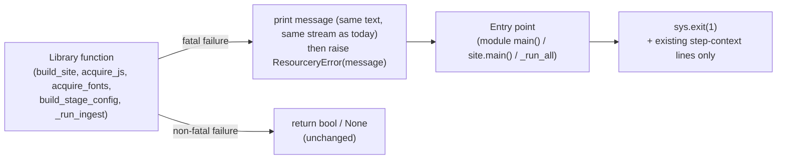

# Library Functions Raise; main() Exits

## Introduction

Several functions that are called **programmatically** — `build_site()`,
`acquire_js()`, `acquire_fonts()`, `build_stage_config()`, and `site.py`'s
private `_run_ingest()` — terminate the process themselves via `sys.exit(1)`
(18 call sites in total: 7 in `build_site()`, 6 in `acquire_js()`, 1 in
`acquire_fonts()`, 1 in `build_stage_config()`, 3 in `_run_ingest()`). This makes them uncallable from library code: any
embedding caller (tests, a future orchestrator, a watch-mode runner) cannot
distinguish "the build failed because fonts.css is missing" from "the process
ended". The consequence is visible in the codebase itself: `site.py:_run_all`
needs an `except SystemExit` workaround around `acquire_fonts` (lines 418-423)
simply to translate a library-internal exit into a pipeline abort message, and
the `all` pipeline silently swallows the `False` return of
`acquire_images_from_config` (line 442).

The goal is to fix the error convention at the mechanism level:
**library functions raise; `main()`s and the `site` dispatch exit**. The
user-visible CLI surface — exit codes, message texts, warn-and-continue
policies — stays **byte-for-byte identical**, because implemented specs freeze
that surface (see Related specs).

## Current state

### Per-module call-site inventory

| Module | Function | Role | `sys.exit(1)` sites | Bool/return issue | Docstring |
|--------|----------|------|---------------------|-------------------|-----------|
| `build.py` | `build_site()` | library (called by `site.py` `build` + `all`) | **7**: 165 (missing `static/css/fonts.css`), 180 (attribution on, `ingest_note` unset), 186 (attribution on, `ingest_site_prompt` unset), 194 (note file missing), 198 (prompt file missing), 205 (note not UTF-8), 211 (prompt not UTF-8) | — | documents `SystemExit` (135) |
| `js_vendor.py` | `acquire_js()` | library (called by `site.py` `all`) | **6**: 143 (package.json missing), 156 (invalid JSON), 166 (no `dependencies.nanostores`), 185 (cannot mkdir vendor dir), 193 (vendor dir not writable), 204 (download failed) | — | documents `SystemExit` (131) |
| `font_acquirer.py` | `acquire_fonts()` | library (called by `site.py` `acquire-fonts` + `all`) | **1**: 403 (some fonts failed to download) | — | documents `SystemExit` (321) |
| `data_ingestion.py` | `build_stage_config()` | library (called by `site.py` `_run_ingest`) | **1**: 440 (unknown stage key) | — | documents `SystemExit` (424) |
| `site.py` | `_run_ingest()` | private helper (called by `site.main()` + `_run_all()`) | **3**: 240 (note/site_prompt unset), 255 (required input unset), 258 (input path missing) | — | none |
| `site.py` | `_run_all()` | pipeline (entry-point status per this spec) | **2**: 408 (validate failed → abort), 420-423 (`except SystemExit` workaround translating `acquire_fonts`' exit into an abort) | **swallows** `acquire_images_from_config`'s `False` at 442 → pipeline silently continues | — |
| `site.py` | `main()` | entry point | 164 (unknown command), 190 (validate subcommand), 200 (acquire-images subcommand) — **legitimate, unchanged** | — | — |
| `image_acquirer.py` | `acquire_images_from_config()` | library (called by `main()` + `site.py`) | — | returns `False` on missing links file (404-406) and on `JsonLoadError` (409-413); `main()`/dispatch translate to exit 1; `_run_all` ignores it | documents bool contract (393-394) |
| `image_acquirer.py` | `main()` | entry point | `return 0/1` (474) + `exit(main())` (478) — **legitimate, unchanged** | — | — |
| `data_ingestion.py` | `main()` | entry point | 1054-1125 — **legitimate, unchanged** | — | — |
| `validate.py` | `main()` | entry point | 721 — **legitimate, unchanged** | — | — |

### Root problems

1. **`build_site()` is uncallable programmatically.** Its own docstring
   advertises `SystemExit` as the error contract. Any embedding caller gets
   the process killed.
2. **`site.py:_run_all` swallows library failures.** The `acquire_images_from_config`
   bool return is discarded at line 442 (see Resolved questions — this is the
   one *intended* swallow), and the `except SystemExit` block at 418-423 is a
   workaround that only exists because library functions call `sys.exit()`.
3. **`_run_ingest()` exits inside a helper.** It is invoked both by
   `main()` dispatch and by `_run_all`; its exits propagate as raw process
   termination rather than as a catchable error.
4. **`data_ingestion.main()` (1054-1125) and `validate.main()` (721) exit
   legitimately** — they are entry points. Same for `site.main()`'s dispatch
   exits (164/190/200) and `image_acquirer.main()`'s `return 0/1`.

## Target state

### Principles

1. **Library functions raise; entry points exit.** The only places that call
   `sys.exit()` are each module's `main()` and the `site.py` dispatch /
   `_run_all` (the process-owning entry points).
2. **Fatal failures → raise; non-fatal failures → return.** The three
   non-fatal patterns stay return-value-based: per-link image acquisition
   (`acquire_for_link` → path/`None`, `_download_image`/`extract_meta_image`/
   `capture_screenshot` → `bool`/`None`), `validate.py`'s collect-errors
   pattern (by design), and the `all` step's missing-links warn-and-continue
   policy (`acquire_images_from_config` keeps its `bool`).
3. **User-visible CLI behavior is identical.** Same exit codes, same message
   texts, same stdout/stderr streams, same warn-and-continue policies —
   only the mechanism changes.
4. **Message-printing is frozen, not fixed.** This spec deliberately keeps
   every existing `print(...)` in place, exactly where it is today. A
   separate logging spec (planned, to follow) will revisit *where and how*
   messages are emitted; this spec only changes the failure *mechanism*.

### New module: `src/resourcery_ssg/errors.py`

A single-purpose module containing one exception (precedent:
`JsonLoadError(ValueError)` in `io_utils.py`):

- `class ResourceryError(Exception)` — carries only the human-readable
  message. Raised by every library function at what is today a `sys.exit(1)`
  site. One shared type keeps entry-point catches uniform
  (`except ResourceryError: sys.exit(1)`) and gives tests a single target.

Rationale for a new module over `io_utils.py`: `io_utils` is JSON I/O;
`config.py` is config resolution. `errors.py` gives process-level errors one
home, mirroring the established "small, single-purpose module" pattern.

### The error-flow convention

**Message ownership:** the library function prints the exact current message
to the exact current stream (stdout vs stderr preserved per call site), then
raises `ResourceryError` carrying the *same text* (a local `msg` variable
feeding both, so the text exists in exactly one place per site). Entry points
print **no** extra error text from the exception — they only emit their
existing step-context lines (e.g. `❌ Font acquisition failed. Aborting
pipeline.`) and exit 1. This preserves every observable byte of today's CLI
output while making the failure catchable. The exception message exists for
tests and programmatic callers.

### Migration table

| Site | Today | After |
|------|-------|-------|
| `build.py` `build_site()` 165/180/186/194/198/205/211 | `print(...)` + `sys.exit(1)` | `print(msg)` + `raise ResourceryError(msg)`; docstring `SystemExit:` → `ResourceryError:` |
| `js_vendor.py` `acquire_js()` 143/156/166/185/193/204 | `print(..., file=sys.stderr)` + `sys.exit(1)` | same, with stderr preserved; docstring updated |
| `font_acquirer.py` `acquire_fonts()` 403 | `print(...)` + `sys.exit(1)` | `print(msg)` + `raise ResourceryError(msg)`; docstring updated |
| `data_ingestion.py` `build_stage_config()` 440 | `print(..., file=sys.stderr)` + `sys.exit(1)` | same, stderr preserved; docstring updated |
| `site.py` `_run_ingest()` 240/255/258 | `print(..., file=sys.stderr)` + `sys.exit(1)` | `print(msg)` + `raise ResourceryError(msg)`; gains a Raises docstring section |
| `site.py` `_run_all()` 418-423 | `except SystemExit as e: if e.code != 0: print(abort); sys.exit(1)` | `except ResourceryError: print("❌ Font acquisition failed. Aborting pipeline."); sys.exit(1)` — the workaround becomes a direct catch of the new type |
| `site.py` `_run_all()` 408 | `sys.exit(1)` on validate failure | **unchanged** (entry point) |
| `site.py` `_run_all()` 442 | `acquire_images_from_config(config, force=...)`, result discarded | **unchanged** — deliberate warn-and-continue (see Resolved questions) |
| `site.py` `main()` | dispatch calls library functions that exit | wrap the dispatch in `try/except ResourceryError: sys.exit(1)` — catches build/ingest/js failures from subcommands and from `_run_all` (which today propagate as `SystemExit`) |
| `build.py` `main()` (367), `js_vendor.py` `main()` (240), `font_acquirer.py` `main()` (432), `data_ingestion.py` `main()` | library call exits directly | wrap the library call in `try/except ResourceryError: sys.exit(1)` |
| `image_acquirer.py` `main()` 474/478, `site.py` 164/190/200, `validate.py` 721, `data_ingestion.py` 1054-1125 | entry-point exits | **unchanged** |

### Exit-code preservation table

| # | CLI scenario | Observable behavior today | After (identical) |
|---|--------------|---------------------------|-------------------|
| 1-7 | `build` failures (fonts.css missing; attribution: note/site_prompt unset, file missing, not UTF-8) | message printed, exit 1 | same message, `build_site` raises, entry catches, exit 1 |
| 8 | `acquire-fonts` (standalone or `site acquire-fonts`) download failure | `⚠️  Some fonts failed — …`, exit 1 | same; `acquire_fonts` raises, entry catches |
| 9 | `acquire-js` (standalone or `site acquire-js`) — 6 failure modes | `Error: …` on stderr, exit 1 | same; `acquire_js` raises, entry catches |
| 10 | `ingest` unknown stage key (standalone or `site ingest`) | `Unknown stage key …` on stderr, exit 1 | same; `build_stage_config` raises, entry catches |
| 11 | `site ingest` note/site_prompt unset | warning on stderr, exit 1 | same; `_run_ingest` raises, `site.main()` catches |
| 12 | `site ingest` input path missing | `Error: … path does not exist …` on stderr, exit 1 | same |
| 13 | `acquire-images` links file missing/unparseable | `⚠️  Links file not found: …`, exit 1 (standalone/dispatch) | **unchanged** — bool contract |
| 14 | `site all` links file missing | `⚠️ … — skipping image acquisition`, pipeline continues | **unchanged** — bool ignored |
| 15 | `site all` validation fails | `❌ Validation failed. Aborting pipeline.`, exit 1 | **unchanged** — `_run_all` exits |
| 16 | `site all` fonts fail | font message + `❌ Font acquisition failed. Aborting pipeline.`, exit 1 | same; `_run_all` catches `ResourceryError` |
| 17 | `site all` JS fails | `Error: …` on stderr, exit 1, **no** abort line | same — propagates to `site.main()` catch-all, which adds nothing |
| 18 | `site all` build fails | build message, exit 1, no abort line | same — propagates to catch-all |
| 19 | `site all` ingest fails | stderr message, exit 1 | same — propagates to catch-all |

### What stays unchanged

- Every entry-point exit: `site.main()` 164/190/200, `_run_all` 408,
  `validate.main()` 721, `data_ingestion.main()` 1054-1125,
  `image_acquirer.main()` 474/478.
- `acquire_images_from_config`'s `bool` contract and `_run_all`'s ignored
  return at 442 (warn-and-continue policy pinned by the implemented
  `entry_point_deduplication.md`).
- All non-fatal return-value patterns (per-link image acquisition, validate's
  collect-errors).
- `run_ingestion` / `run_multi_step_ingestion` retry-exhaustion `RuntimeError`
  — already raise-based, out of scope.
- Message texts, stdout/stderr streams, and exit codes at every call site.
- The `pyproject.toml` entry points (module `main()`s keep their signatures).

## Resolved questions

1. **What exception type and where?** — **Resolved: a single shared
   `ResourceryError(Exception)` in a new `src/resourcery_ssg/errors.py`.**
   Precedent: `JsonLoadError(ValueError)` in `io_utils.py`. A single shared
   type gives every entry point one uniform `except ResourceryError`, one
   test target, and no import sprawl; per-module exceptions would multiply
   wiring without benefit. Standard exceptions (`ValueError`/`RuntimeError`)
   were rejected: they would collide with unrelated failures (e.g.
   `JsonLoadError(ValueError)`) and force entry points to catch too broadly.
2. **Who prints the error message — library or entry point?** — **Resolved:
   the library prints (same text, same stream as today) and then raises an
   exception carrying the identical message.** Printing only at entry points
   would change the stdout/stderr split for `build.py` errors (today stdout,
   `js_vendor`/`data_ingestion` stderr) and violate the "identical CLI
   behavior" constraint; printing at the raise site keeps every observable
   byte identical with a mechanical transformation. The exception message
   (same text) serves tests and programmatic callers.
   **Note:** message-printing is *explicitly out of scope* here. A separate
   logging spec (planned, to follow) will revisit where and how messages are
   emitted — this spec deliberately freezes the prints in place to avoid
   churning them twice. When that spec lands, it will migrate the printing
   layer without touching the raise/exit mechanism defined here.
3. **Should `_run_all` abort when `acquire_images_from_config` returns
   `False`?** — **Resolved: No.** The implemented
   `entry_point_deduplication.md` freezes the `all` pipeline's
   warn-and-continue policy for a missing/unparseable links file; the bool
   return *is* the mechanism for that policy. The pitch's "site.py swallows
   errors" observation is thereby resolved as *intended behavior* — the
   actual defect being fixed is the `sys.exit`-in-library problem, not this
   policy. `acquire_images_from_config` and `_run_all:442` are **not
   modified** by this spec (user-confirmed).
4. **Does `_run_all` gain or lose any abort messages?** — **Resolved: none.**
   Only the font step has an abort line today (418-423); JS/build/ingest
   failures propagate as `SystemExit` and exit 1 without extra context.
   Post-migration they propagate as `ResourceryError` to the `site.main()`
   catch-all, which exits 1 and adds nothing — identical output.

## Related specs

### Depends upon
- [refactors/entry_point_deduplication.md](entry_point_deduplication.md)
  (implemented, tag `specs/refactors/entry_point_deduplication.md/implemented`)
  — created `acquire_images_from_config` and `build_stage_config`, the exact
  functions whose exit sites this spec migrates, and froze the CLI
  surface/exit-code contracts (rows 13-16 of the preservation table) that
  this spec must not disturb.

### Extends
- [refactors/entry_point_deduplication.md](entry_point_deduplication.md) —
  that spec unified the flows but left the `sys.exit` mechanisms in the
  shared functions; this spec replaces the *mechanism* while keeping the
  contracts it defined. Implemented specs are immutable, so this is a new
  spec rather than an amendment.
- [feats/build_attribution.md](../feats/build_attribution.md) (implemented,
  tag `specs/feats/build_attribution/implemented`) — documents the exact
  "Build exits with error: …" messages for attribution failures; rows 2-7 of
  the preservation table keep those messages byte-identical.
- [feats/per_stage_configuration.md](../feats/per_stage_configuration.md)
  (implemented, tag `specs/feats/per_stage_configuration.md/implemented`) —
  the `build_stage_config` unknown-key hard error (row 10) is preserved; only
  `sys.exit(1)` becomes a raise at the same site.
- [feats/multi_step_ingestion.md](../feats/multi_step_ingestion.md)
  (implemented, tag `specs/feats/multi_step_ingestion.md/implemented`) —
  exit-code-1 semantics on stage/retry failures (rows 11-12, 19) are
  preserved.

### Enables
- Programmatic callers of `build_site` / `acquire_js` / `acquire_fonts` /
  `build_stage_config` / `_run_ingest` — any future in-process orchestration
  (watch mode, a runner API, a GUI, richer tests) can now catch failures
  instead of losing the process.
- A future spec that makes `_run_all` compositional (e.g. reusable pipeline
  steps) — no longer blocked by `SystemExit`-in-library.
- The planned **logging spec** — with the raise/exit mechanism in place, that
  spec can freely relocate message emission (e.g. a logging module,
  structured output) without re-touching the failure flow. This spec
  deliberately keeps prints as-is so the logging spec starts from a clean,
  unchurned baseline.

### Supersedes
- None.

## Technical details

- **Single-source message pattern:** every migrated site becomes
  `msg = "<exact current text>"; print(msg[, file=<current stream>]); raise
  ResourceryError(msg)`. The text must not be reworded — implemented specs
  pin it (build_attribution.md for rows 2-7, per_stage_configuration.md for
  row 10).
- **`site.main()` catch-all placement:** wrap the dispatch block after
  `load_resourcery_config` (lines 158-207). It must catch only
  `ResourceryError` — not `SystemExit` (the entry-point exits at 164/190/200
  and inside `_run_all` must keep propagating), and not config-loading
  `JsonLoadError`/`ValueError` (unchanged behavior, out of scope).
- **`_run_all` must not grow abort lines:** JS (step 3), build (step 5) and
  ingest (step 0) failures today exit 1 with no "Aborting pipeline" text; the
  new catch-all must preserve that (no new print in `_run_all` for those
  steps).
- **`_run_ingest` gains a `Raises: ResourceryError` docstring section** per
  `specs/docs/docstring.md` (format: exception-name: condition, under
  Returns, before Side-effects). It is private, but it is called from two
  places and now raises, so the contract must be documented.
- **Docstrings to update** (`SystemExit:` → `ResourceryError:`):
  `build.py:135`, `js_vendor.py:131`, `font_acquirer.py:321`,
  `data_ingestion.py:424`; `image_acquirer.py:393-394` stays as-is (bool
  contract unchanged).
- **Tests to update** (all flip `pytest.raises(SystemExit)` +
  `exc_info.value.code == 1` to `pytest.raises(ResourceryError)` +
  message assertion; the message is available both via `capsys` and
  `str(exc_info.value)`):
  - `tests/test_build.py:251-315` — 5 tests (missing ingest_note,
    missing site_prompt, missing note file, missing prompt file, UTF-8
    decode).
  - `tests/test_site.py:70-124` — 4 missing-value tests + 1
    unknown-stage-key test; also the two missing-input-file tests at
    195-217. The "must not raise" tests at 233/241 are unaffected (no-error
    paths still return cleanly). `_patch_ingestion_module` (130-147) needs no
    change — it keeps the real `build_stage_config`.
  - `tests/test_data_ingestion.py:175-176` — unknown-key test.
  - `tests/test_js_vendor.py:203, 215` — missing package.json /
    missing nanostores key.
  - `tests/test_image_acquirer.py:227, 238` — **no change** (bool contract
    preserved).
- **Tests to add:**
  - `_run_all` font-failure abort (new coverage — none exists today):
    monkeypatch `resourcery_ssg.font_acquirer.acquire_fonts` to raise
    `ResourceryError`; assert `SystemExit` code 1 and
    "Font acquisition failed. Aborting pipeline." in stdout.
  - `_run_all` build-failure path: monkeypatch `build_site` to raise
    `ResourceryError`; assert `SystemExit` code 1 and the absence of any new
    abort line (guards against accidental message growth).
  - `site.main()` catch-all e2e (optional, if existing fixtures allow):
    monkeypatched `sys.argv` + `--config` fixture, failing library step →
    `SystemExit` code 1.
  - **Expanded coverage during implementation** (all 18 raise sites now
    unit-tested): `build.py` fonts.css-missing (165) and note-UTF-8 (205)
    twins; all six `js_vendor.py` sites (156 invalid JSON, 185 uncreatable
    vendor dir, 193 not-writable via monkeypatched `os.access` — root-safe,
    and 204 download failure via monkeypatched `download_nanostores`); both
    sub-branches of the `font_acquirer.py` all_ok flow (403) via network-free
    seams. Entry-point exits added: `_run_all` validate-abort (419),
    `site.main()` validate and acquire-images dispatch exits (193/203),
    `validate.main()` (721) both code paths, `image_acquirer.main()` return
    values 0/1 (patched `acquire_images_from_config`), and
    `data_ingestion.main()` exits (1054 required-value, 1090
    `build_stage_config` wrap, 1124 `RuntimeError` catch). The unknown-command
    branch (167) is **unreachable** — argparse `required=True` subparsers
    reject unknown commands with `SystemExit(2)` first — and is not tested
    (would only test argparse).
- **No packaging changes:** `errors.py` is an internal module — no new
  `pyproject.toml` scripts or dependencies.
