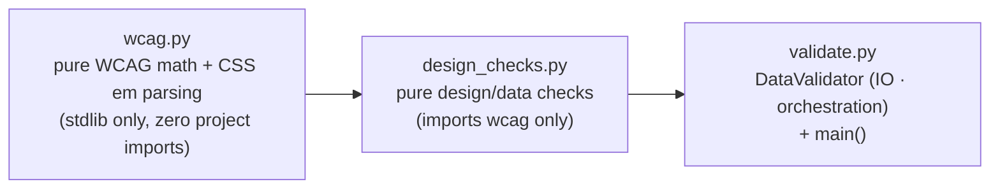

# Split validate.py into three layered modules (wcag / design_checks / validate)

## Introduction

`src/resourcery_ssg/validate.py` (762 lines) mixes four distinct concerns in a
single file: pure WCAG math (luminance/contrast), pure design-token checks that
are awkwardly coupled to the validator by mutating `DataValidator.errors`,
the `DataValidator` class itself (schema/data loading = IO, network font
checks), and the CLI `main()`. Consequences:

- The design-token checks can only be exercised through a fully-constructed
  `DataValidator` (IO + jsonschema), so the purest logic in the file is the
  hardest to unit-test.
- `validate_design_tokens`, `validate_effects`, and the category/tag/color
  checks from `cross_validate` are inline in a class whose only reason to
  exist is IO orchestration — the exact situation the CONTRIBUTING.md
  long-term Todo (line 404) calls out: *"Consider extracting category/tag/
  effect validation into a dedicated validation module instead of inline
  functions in validate.py."*
- The WCAG math (useful to any module that touches colour, e.g. build-time
  palette generation) is buried in a file whose import pulls in `jsonschema`,
  logging, and IO.

The goal is a three-layer structure with a single direction of dependency —
pure math → pure checks → IO/orchestration — without changing any
user-visible behaviour, CLI surface, error/warning text, or exit-code
contract.

## Current state

`src/resourcery_ssg/validate.py` (verified at commit `706b539`):

| Concern | Location | Contents | Coupling |
|---------|----------|----------|----------|
| (a) WCAG math | lines 25-98 | `_hex_to_srgb`, `_linearize`, `relative_luminance`, `contrast_ratio`, `parse_em` | none (pure) |
| (b) Design-token checks | lines 106-270 | `validate_design_tokens`, `_check_range`, `_check_contrast_pair` | mutates `validator_instance.errors` / reads `validator_instance.design_data` |
| (c) `DataValidator` class | lines 273-714 | `load_schemas`, `load_data`, `validate_effects`, `validate_schema`, `validate_fonts` (network via `font_acquirer`), `extract_valid_categories`, `cross_validate`, `_is_valid_hex_color`, `validate_all`, `_print_results` | IO + jsonschema + network |
| (d) CLI | lines 716-758 | `main()` | config/logging |

Consumer import sites (verified):

| Consumer | Symbol(s) used | Touched by this spec? |
|----------|----------------|-----------------------|
| `src/resourcery_ssg/site.py` (242, 440) | `DataValidator` | No |
| `src/resourcery_ssg/data_ingestion.py` (23; `.cross_validate()` at 902) | `DataValidator` | No |
| `tests/test_validate.py` (6-7; `validator.validate_effects()` at 94/110/123, `validator.cross_validate()` at 163-233, `validator._is_valid_hex_color(...)` at 240-250) | `DataValidator`, `main as validate_main` | **Yes** — `TestValidateEffects` (90-124) and `TestIsValidHexColor` (237-250) call the moved symbols via the class; rewritten against `design_checks` (see Tests). The `cross_validate` tests (163-233) are untouched — that method stays |
| `tests/test_logutil.py` (263) | `DataValidator` | No |
| `tests/test_data_ingestion.py` (11; `.cross_validate()` at 368/439) | `DataValidator` | No |
| `tests/test_site.py` (342, 694 — mocks `resourcery_ssg.validate.DataValidator.validate_all`) | `DataValidator` (qualified path) | No (class stays in `validate.py`) |
| `tests/test_design_validate.py` (5-6; inline `from resourcery_ssg.validate import validate_design_tokens` at 122/136/154; `DataValidator` constructions at 117/132/150/234/249/262; `validator.validate_effects()` at 242/257/272) | `DataValidator`, `relative_luminance`, `contrast_ratio`, `parse_em`, `validate_design_tokens` | **Yes** — imports move to `wcag`/`design_checks`; the three `validate_design_tokens` tests (117-158) and the three `validate_effects` tests (227-273) are rewritten against the pure API; the `DataValidator` import is **dropped entirely** (it is only used as a bare container for the pure functions — no remaining use after the rewrite) |

Known cruft inside the file (opportunistic dedup targets, both behaviour-neutral):

- Line 610: redundant `import re` inside `_is_valid_hex_color` — `re` is
  already imported at module level (line 8).
- Lines 522/545: `valid_tags` is collected in `cross_validate` and never read
  anywhere.

## Target state

Three modules with a single dependency direction:

### New module: `src/resourcery_ssg/wcag.py`

Pure, deterministic math/format helpers. **Zero project imports** (stdlib
only). Contains, moved verbatim from `validate.py`:

- `relative_luminance(hex_color: str) -> float`
- `contrast_ratio(color1: str, color2: str) -> float`
- `parse_em(value: str) -> Optional[float]`
- `_hex_to_srgb`, `_linearize` — module-private (unchanged names, single
  leading underscore).

### New module: `src/resourcery_ssg/design_checks.py`

Pure check functions — **no IO, no jsonschema, no logging, no class state**.
Imports only from `wcag.py`. All public check functions share one contract:
they return `(errors, warnings)` tuples of message strings; `errors` are
build-failing, `warnings` are advisory (this mirrors exactly how the current
code splits between `self.errors` and `self.warnings`). No function mutates
anything.

| Function | Signature | Source (moved from) | Produces |
|----------|-----------|---------------------|----------|
| `validate_design_tokens(design: dict) -> Tuple[List[str], List[str]]` | `(errors, warnings)` | `validate.py:106-209`, reworked from `(validator_instance)` to `(design)` | range + WCAG contrast violations → errors (same checks, same message text, same thresholds as implemented by `design_token_system.md`) |
| `validate_effects(design: dict) -> Tuple[List[str], List[str]]` | `(errors, warnings)` — warnings-only today | `DataValidator.validate_effects` (365-408), reworked to pure | card_style/hover_effect/border/elevation contradiction warnings |
| `validate_cross_references(config_data: dict, links_data: dict, design_data: dict) -> Tuple[List[str], List[str]]` | `(errors, warnings)` | body of `DataValidator.cross_validate` (508-600), reworked to pure | duplicate link IDs → errors; unknown category, active-link-missing-URL, suspicious image path, suspicious menu-link URL, invalid hex colours (incl. `dark.*`) → warnings |
| `is_valid_hex_color(color: str) -> bool` | — | `DataValidator._is_valid_hex_color` (602-614), **renamed public**, redundant `import re` dropped | — |
| `extract_valid_categories(config_data: dict) -> Set[str]` | — | `DataValidator.extract_valid_categories` (487-506), reworked to pure | parent + child category IDs |

Module-private helpers `_check_range` and `_check_contrast_pair` move with
`validate_design_tokens` (builder's choice whether they append to passed
lists or return messages; the public contract is only the `(errors, warnings)`
tuple). The dead `valid_tags` collection is **dropped** (never read; no test
references it).

### `validate.py` after the split

Keeps `DataValidator` + `main()`. New responsibilities:

- **IO unchanged:** `load_schemas` / `load_data` (via `io_utils.load_json`
  wrappers, as already consolidated by `entry_point_deduplication.md`),
  `validate_schema`, `validate_fonts` (lazy `font_acquirer` /
  `theme_constants` imports and network behaviour preserved), `validate_all`
  sequencing, `_print_results`, `main()`.
- **Class API reduced to what stays in the class** (strict clean break — no
  delegates, no forwarding methods; every symbol that moves is *deleted* from
  the class and every caller is updated):
  - `cross_validate()` **stays** — it is not a forwarder: it owns the IO state
    access, the `log_user` reporting, and the return contract
    (returns `True` when data loaded; warnings alone do not fail) used by
    `data_ingestion.py:902` and the `cross_validate` tests. Its body calls
    `design_checks.validate_cross_references(...)` and
    `design_checks.extract_valid_categories(...)` and extends `self.errors` /
    `self.warnings`.
  - `validate_effects()` — **removed from the class**. Callers updated:
    `validate_all()` calls `design_checks.validate_effects(self.design_data)`
    and extends `self.warnings`; the two test classes that called it via a
    validator are rewritten (see Tests).
  - `_is_valid_hex_color()` — **removed from the class**. The logic lives as
    public `design_checks.is_valid_hex_color`; the `cross_validate` body
    (now in `design_checks`) and `tests/test_validate.py::TestIsValidHexColor`
    call it directly.
  - `extract_valid_categories()` — **removed from the class** (only internal
    caller was `cross_validate`; no test uses it directly).
  - `validate_all()` calls `design_checks.validate_design_tokens(self.design_data)`
    and `design_checks.validate_effects(self.design_data)` where it currently
    calls `validate_design_tokens(self)` (line 666) and
    `self.validate_effects()` (line 667), and extends `self.errors` /
    `self.warnings`.
- `wcag` / `design_checks` are imported at the top of `validate.py`; the
  moved functions are **deleted** from `validate.py` (no re-export lines, no
  shim imports — clean break).

### CLI surface

`main()` and `validate.py`'s CLI flags, exit codes, and log output are
unchanged. The module remains a valid target for the `validate` script entry
point in `pyproject.toml`.

### Tests

- `tests/test_design_validate.py` — import updates + pure-API rewrites:
  - line 6 → `from resourcery_ssg.wcag import relative_luminance, contrast_ratio, parse_em`
  - the three `validate_design_tokens` tests (117-158) are rewritten against
    the pure API: build a `design` dict directly and assert on the returned
    `(errors, warnings)` tuples instead of constructing a `DataValidator` and
    setting `design_data`.
  - the three `validate_effects` tests (227-273) are rewritten the same way:
    `design_checks.validate_effects(design_dict)` directly, no
    `DataValidator` container.
  - the `from resourcery_ssg.validate import DataValidator` import (line 5)
    is **dropped** — after the rewrites no test in the file uses it.
- `tests/test_validate.py` — two test classes updated:
  - `TestValidateEffects` (90-124): the three tests call
    `design_checks.validate_effects(design_dict)` (module-level import added)
    and assert on the returned warnings tuple; the `validator` fixture use is
    dropped from this class.
  - `TestIsValidHexColor` (237-250): `validator._is_valid_hex_color(...)`
    becomes `design_checks.is_valid_hex_color(...)` (module-level import
    added).
  - Everything else in the file (including the `cross_validate` tests at
    163-233) is unchanged.
- All other existing tests pass unchanged.
- New unit tests are recommended (this is the point of the split):
  `design_checks` functions exercised with plain dicts, no jsonschema/IO.
  `wcag` functions are already covered by the moved tests in
  `test_design_validate.py`.

## Resolved questions

1. **"test_validate.py is untouched (they only use DataValidator)"** — at the
   method level this was not accurate: `test_validate.py` calls
   `validator.validate_effects()` (94/110/123) and
   `validator._is_valid_hex_color(...)` (240-250). **Resolved by user
   directive (strict clean break):** no delegating methods, no forwarding
   shims of any kind. `validate_effects` and `_is_valid_hex_color` are
   deleted from the class; the ~12 call sites in `test_validate.py` are
   updated to call the `design_checks` functions directly. The project has no
   backwards-compatibility obligation; a stale method is pure dead weight.
2. **Uniform return signature.** All public `design_checks` check functions
   return `(errors, warnings)` tuples, even where today only one list is
   populated (e.g. `validate_effects`). One contract, one extension pattern
   in `DataValidator`.
3. **`is_valid_hex_color` naming.** The colour-format helper is promoted from
   `_is_valid_hex_color` (class-private) to a public module-level function in
   `design_checks.py`.
4. **Dead code removal.** The redundant `import re` (line 610) and the
   `valid_tags` collection in `cross_validate` are dropped — both are
   behaviour-neutral and covered by the existing suite's green status.

## Open questions

1. **Companion spec sync.** `specs/refactors/ingest_module_split.md` is being
   drafted in parallel for `data_ingestion.py`. Both refactors are compatible:
   this spec leaves `data_ingestion.py`'s `from resourcery_ssg.validate
   import DataValidator` import untouched, and `DataValidator` remains the
   public validation API for the ingest pipeline (only its *method surface*
   shrinks — `data_ingestion.py` uses `cross_validate`, `load_schemas`,
   `load_data`, `validate_schema`, which all stay). No sequencing dependency;
   each can land independently.

## Related specs

### Depends upon
- None — every spec whose code this touches
  ([`design_token_system.md`](design_token_system.md),
  [`data_design_split.md`](data_design_split.md),
  [`multi_step_ingestion.md`](../feats/multi_step_ingestion.md),
  [`entry_point_deduplication.md`](entry_point_deduplication.md)) is
  implemented (`implemented_git_tag` set).

### Enables
- Pure unit tests for all design/data checks without jsonschema or IO.
- Reuse of `wcag.py` math by other build-time modules (e.g. `token_gen.py`,
  future build-time palette enforcement) without importing `jsonschema`.
- Independent evolution of validation rules vs. the IO/orchestration layer.
- Fulfils the CONTRIBUTING.md long-term Todo (line 404); tick it off as part
  of implementation.

### Extends
- [`design_token_system.md`](design_token_system.md) (implemented) — that
  spec introduced the `validate_design_tokens()` contrast/range/effects logic
  as "additions to `validate.py`"; this spec repackages that logic into a
  dedicated pure module. Behavioural contract (checks, thresholds, message
  text, errors-vs-warnings split) is **preserved exactly**; implemented specs
  are immutable, so this is new scope, not an amendment.

### Supersedes
- None.

### See also
- `specs/refactors/ingest_module_split.md` — companion refactor (in parallel
  draft) splitting `data_ingestion.py`; no code overlap, see Open questions.
- `CONTRIBUTING.md` line 404 — the Todo this spec fulfils.

## Technical details

- **Move, don't rewrite.** `wcag.py` functions move verbatim (only the module
  docstring is new, per `specs/docs/docstring.md` conventions). `design_checks`
  functions keep their check logic, message strings, thresholds, and
  error/warning classification; only the plumbing (validator-instance
  parameter, mutation of `.errors`) is reworked into the pure tuple contract.
- **No packaging changes.** Both new modules are internal — no new
  `pyproject.toml` scripts, no new dependencies. `wcag.py` must import
  nothing from the project (stdlib only); `design_checks.py` may import only
  from `wcag.py`.
- **`validate.py` import surface after the split:** `logging`, `re`, `sys`,
  `pathlib`, `jsonschema`, `io_utils`, `logutil`, plus the new
  `wcag`/`design_checks` imports. No other module imports `validate.py` for
  the moved symbols (verified: the only external references to
  `relative_luminance` / `contrast_ratio` / `parse_em` /
  `validate_design_tokens` are in `tests/test_design_validate.py`).
- **Mock-path safety:** `tests/test_site.py` (342, 694) mocks the qualified
  path `resourcery_ssg.validate.DataValidator.validate_all` — valid because
  `DataValidator` stays in `validate.py`.
- **Schema description stability:** `schemas/design.schema.json` (line 215)
  and `design_token_system.md` mention `validate_design_tokens()` by name —
  the name is preserved, so no text updates are required.
- **Docstrings:** follow the standardised `param:` / `Returns:` /
  `ExceptionName:` / `Side-effects:` format per `specs/docs/docstring.md`.
  For the pure functions, `Side-effects:` is omitted; `validate_all`'s
  docstring should note that design checks now run via `design_checks`.
- **Target metrics (approx.):** `validate.py` 762 → ~440 lines (DataValidator
  + main + imports; three methods deleted); `wcag.py` ~80;
  `design_checks.py` ~210.
- **Validation of the refactor:** existing suite must stay green after
  editing exactly two test files — `tests/test_design_validate.py` (imports +
  two rewritten test classes) and `tests/test_validate.py` (two rewritten
  test classes). `test_logutil.py`, `test_data_ingestion.py`, `test_site.py`,
  `site.py`, and `data_ingestion.py` are untouched.

## Decisions

1. **STRICT CLEAN BREAK, no delegates, no shims** (user directive). No
   backwards-compatibility obligations exist; every symbol that moves is
   deleted from its old home and every call site is updated in the same
   change. `DataValidator` keeps only what genuinely stays: IO
   (`load_schemas`/`load_data`/`validate_schema`/`validate_fonts`),
   orchestration (`validate_all`/`cross_validate`/`_print_results`), and
   `main()`. `validate_effects`, `_is_valid_hex_color`,
   `extract_valid_categories` are removed from the class.
2. **`cross_validate()` stays as an orchestrating method** — it is not a
   forwarder: it owns IO state access, `log_user` reporting, and the return
   contract consumed by `data_ingestion.py` and the cross-validate tests. Its
   pure logic lives in `design_checks.validate_cross_references`.
3. **All public `design_checks` functions return `(errors, warnings)`
   tuples** — one contract, no mutation.
4. **Dead code removal is in scope** (redundant `import re` line 610,
   `valid_tags` at 522/545) — behaviour-neutral, covered by the suite.
